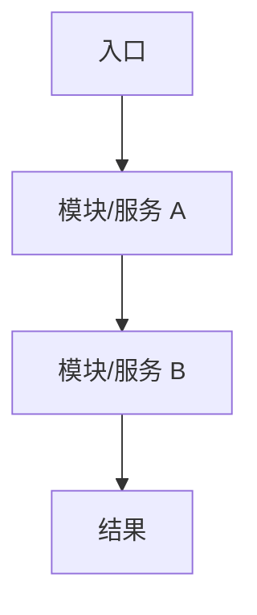
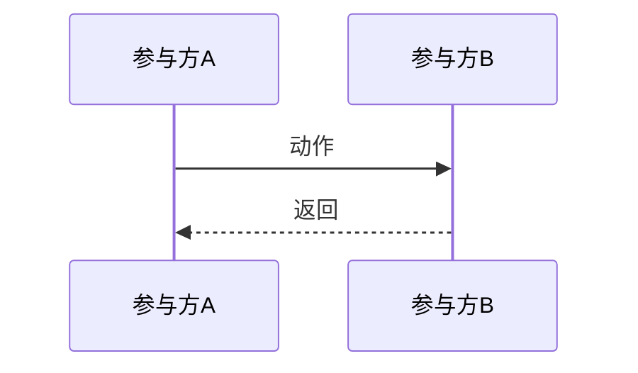

# DES 文档模板（增强版）

本文档为 `/design` 命令的增强版模板。

目标不是只补齐章节，而是生成一份：
- 先看得懂整体架构与关键链路
- 再看得懂每个核心功能点如何落地
- 最终可直接进入开发、拆解与评审的 DES

---

# DES-{YYYYMMDD}-{序号}-{名称}

| 字段 | 值 |
|------|-----|
| 文档编号 | DES-{YYYYMMDD}-{序号}-{名称} |
| 关联需求 | REQ-{YYYYMMDD}-{序号}-{名称} |
| 创建日期 | {YYYY-MM-DD} |
| 负责人 | {负责人} |
| 状态 | 草稿 / 评审中 / 已批准 |
| 最后更新 | {YYYY-MM-DD} |
| 需求类型 | 机制型 / 接入型 / 混合型 |

---

## 一、概述与阅读导航

### 1.1 设计目标

{描述本次设计要解决的问题、达成的效果、为什么需要这个设计}

### 1.2 范围边界

#### 本次设计覆盖

- {覆盖内容 1}
- {覆盖内容 2}

#### 本次明确不做

- {不做内容 1}
- {不做内容 2}

### 1.3 设计原则

- 单一职责原则
- 复用现有稳定底座
- 最小侵入原则
- {其他适用原则}

### 1.4 阅读建议

> 先阅读第二章的整体总览视图，建立“这个需求整体如何运转”的心智模型；再阅读第四章的功能点详细设计，理解每个功能点如何落地；最后查看第五至第八章的横切汇总、测试与风险。

---

## 二、需求整体总览视图

> 本章用于回答：**这个需求整体长什么样、有哪些功能点、它们如何串起来形成完整效果。**

### 2.1 整体架构图 / 全链路总览图

> 根据需求类型选择：
> - 机制型：优先使用全链路时序图 / 状态流转图
> - 接入型：优先使用总体架构图 / 数据流图
> - 混合型：两者择要组合



{说明整体参与模块、职责边界、关键数据或状态如何流动}

### 2.2 功能点总表

| 功能点 | 目标 | 关键参与模块 | 关键数据/状态 | 是否需要详细时序 |
|--------|------|--------------|----------------|------------------|
| {功能点1} | {目标} | {模块} | {数据/状态} | 是/否 |
| {功能点2} | {目标} | {模块} | {数据/状态} | 是/否 |

### 2.3 核心链路串联说明

{用 3~8 条 bullet 或 2~4 段文字说明：用户/系统从哪里进入，功能点如何前后衔接，最终形成什么完整效果。}

### 2.4 关键设计总览

| 设计主题 | 结论 | 原因 |
|----------|------|------|
| {例如：上下文准备位置} | {放在 admin_backend} | {避免侵入标准 chat 主链路} |
| {例如：Session 模式} | {一文档一 Session} | {锁粒度清晰} |

---

## 三、项目现状分析与设计约束

> 本章节基于对现有项目代码的分析，说明设计为什么能落在当前代码结构上，以及哪些能力可以复用。

### 3.1 技术栈概览

| 层级 | 当前技术 | 版本 |
|------|----------|------|
| 运行时 | {从项目配置提取} | |
| 后端框架 | {从项目配置提取} | |
| 前端框架 | {从项目配置提取} | |
| 数据库 | {从项目配置提取} | |
| 缓存/消息 | {从项目配置提取} | |

### 3.2 项目结构

```text
{从项目目录结构提取关键目录布局}
project-root/
├── {关键目录}
└── ...
```

### 3.3 相关现有模块

| 模块名 | 位置 | 与本次设计的关系 |
|--------|------|------------------|
| {模块名} | {路径} | {可复用/需扩展/需修改} |

### 3.4 现有可复用能力

- {可复用能力 1：例如已有标准 chat-ws 主链路}
- {可复用能力 2：例如已有 session 生命周期管理}
- {可复用能力 3：例如已有 request context 注入机制}

### 3.5 设计约束（来自现有代码 / 宪法）

- {分层约定}
- {接口风格约定}
- {数据库建模约定}
- {多服务依赖方向约束}
- {其他关键限制}

---

## 四、功能点详细设计

> 本章是 DES 的核心。不要只写概念，要按功能点把设计写深。
>
> 每个核心功能点应尽量覆盖以下维度：
> - 功能目标与边界
> - 触发方式 / 入口
> - 核心逻辑
> - 关键流程 / 状态流转
> - 时序图 / 流程图（按需）
> - 伪代码 / 关键算法（按需）
> - 涉及接口设计（如有）
> - 涉及数据结构 / 库表设计（如有）
> - 与现有项目关联（复用什么、改什么、为什么）
> - 边界与失败处理

### 4.1 {功能点一名称}

#### 4.1.1 功能目标与边界

{这个功能点具体解决什么问题，边界到哪里为止}

#### 4.1.2 触发方式 / 入口

{用户或系统从哪里进入这个功能点，前置条件是什么}

#### 4.1.3 核心逻辑

{分步骤说明主流程，不要只写一句话概述}

#### 4.1.4 关键流程 / 状态流转

{如果存在状态变化、异步链路、锁、生命周期、回退等，需要结构化说明}

#### 4.1.5 时序图 / 流程图（按需）



{说明为什么需要这张图，以及图中每一步对应的设计含义}

#### 4.1.6 伪代码 / 关键算法（按需）

```python
# 只在存在规则判断、聚合、调度、裁剪、状态切换时给出
```

{解释伪代码的输入、输出、关键判断和放置位置}

#### 4.1.7 涉及接口设计（如有）

| 接口名称 | 方法 | 路径 | 调用方 | 说明 |
|----------|------|------|--------|------|
| {接口名} | POST | {路径} | {调用方} | {说明} |

#### 4.1.8 涉及数据结构 / 库表设计（如有）

> 若涉及数据库表设计，**必须优先使用 DDL 代码块表达**（`CREATE TABLE` / `ALTER TABLE` / `CREATE INDEX` 等），不要只用字段表格替代。表格可用于补充说明非库表对象（如 schema / cache / event），但数据库表本身必须给出 DDL。

**数据库表设计（DDL）**

```sql
-- 新增表
CREATE TABLE {表名} (
    id VARCHAR(32) NOT NULL COMMENT '主键',
    ...
) COMMENT='{表说明}';

-- 或修改表
ALTER TABLE {表名}
    ADD COLUMN {字段名} {类型} COMMENT '{说明}';
```

**设计说明**
- {说明字段、索引、软删除、版本化、迁移、与项目规范的关系}

#### 4.1.9 与现有项目关联

- 复用：{现有模块/文件/能力}
- 修改：{哪些模块/文件需要扩展}
- 原因：{为什么放在这里，而不是别处}

#### 4.1.10 边界与失败处理

- {异常场景 1} → {处理策略}
- {异常场景 2} → {处理策略}

---

### 4.2 {功能点二名称}

> 重复 4.1 的结构。核心功能点必须逐个展开，禁止只列标题。

---

### 4.N {功能点 N 名称}

> 继续按同样结构展开。

---

## 五、横切设计汇总

> 本章收口详细设计中分散出现的横向内容，方便开发与评审快速检索。

### 5.1 接口设计汇总

#### 5.1.1 接口列表

| 序号 | 接口名称 | HTTP 方法 | 路径 | 调用方 | 说明 |
|------|----------|-----------|------|--------|------|
| 1 | {接口名} | POST | {路径} | {调用方} | {说明} |

#### 5.1.2 接口详情（仅对关键接口展开）

##### 5.1.2.1 {接口名称}

**基本信息**

| 项目 | 值 |
|------|-----|
| 路径 | {路径} |
| 方法 | {HTTP 方法} |
| 描述 | {接口描述} |

**请求参数**

| 参数名 | 类型 | 必填 | 来源 | 说明 |
|--------|------|------|------|------|
| {参数名} | {类型} | 是/否 | body | {说明} |

**请求示例**

```json
{
  "field": "value"
}
```

**响应示例**

```json
{
  "code": 0,
  "message": "success",
  "data": {}
}
```

**错误码 / 业务异常**

| 错误码 | 含义 | 处理建议 |
|--------|------|----------|
| {错误码} | {含义} | {处理建议} |

---

### 5.2 数据库 / 模型设计汇总

> 数据库表设计默认使用 **DDL 写法**，不要用字段表格替代真实表结构。若只涉及非库表对象（如 schema / cache / event），可继续使用说明或表格。

#### 5.2.1 表结构变更（DDL）

##### 5.2.1.1 新增表：{表名}

```sql
CREATE TABLE {表名} (
    id VARCHAR(32) NOT NULL COMMENT '主键',
    ...
) COMMENT='{表说明}';
```

##### 5.2.1.2 修改表：{表名}

```sql
ALTER TABLE {表名}
    ADD COLUMN {字段名} {类型} COMMENT '{说明}';
```

**建表 / 变更说明**
- {说明与项目规范、逻辑关联、软删除、comment、版本化、迁移等相关事项}

#### 5.2.2 索引设计（DDL）

```sql
CREATE INDEX idx_xxx ON {表名} ({字段});
-- 或
CREATE UNIQUE INDEX udx_xxx ON {表名} ({字段});
```

**索引说明**
- {说明为什么需要该索引、是否属于唯一性例外场景}

#### 5.2.3 Schema / DTO / 缓存 / 事件（如适用）

| 对象 | 所在层 | 变更 | 说明 |
|------|--------|------|------|
| {schema名} | common / service / frontend | 新增/修改 | {说明} |

---

### 5.3 配置变更

#### 5.3.1 环境变量

| 变量名 | 类型 | 必填 | 默认值 | 说明 |
|--------|------|------|--------|------|
| {变量名} | {类型} | 是/否 | {默认值} | {说明} |

#### 5.3.2 配置文件片段

```yaml
# 示例
feature:
  enabled: true
```

### 5.4 多服务改动

#### 5.4.1 涉及服务

| 服务名称 | 改动类型 | 说明 |
|----------|----------|------|
| {服务名} | 新增/修改/删除 | {改动说明} |

#### 5.4.2 改动说明

{说明各服务职责边界和依赖方向}

### 5.5 安全 / 权限 / 审计（如适用）

- {权限控制点}
- {数据安全 / 输入校验点}
- {操作日志 / 审计要求}

---

## 六、测试与验证

> 测试点应能追溯到功能点或 REQ 验收标准，而不是泛泛列测试类型。

### 6.1 功能点测试追溯

| 功能点 | 测试场景 | 场景类型 | 预期结果 |
|--------|---------|---------|---------|
| {功能点1} | {场景} | 正常/边界/异常 | {预期} |

### 6.2 单元测试点

- [ ] {测试点1}
- [ ] {测试点2}

### 6.3 集成测试点

- [ ] {测试点1}
- [ ] {测试点2}

### 6.4 E2E / 页面 / 端到端测试（如适用）

- [ ] {测试点1}
- [ ] {测试点2}

### 6.5 验证方式

- {如何验证整体链路}
- {如何验证边界与失败场景}
- {如何验证与现有模块兼容}

---

## 七、风险与注意事项

### 7.1 技术风险

| 风险项 | 影响 | 缓解措施 |
|--------|------|----------|
| {风险描述} | {影响程度} | {缓解措施} |

### 7.2 注意事项

- {注意事项1}
- {注意事项2}

### 7.3 宪法偏离说明

> 若设计中存在与宪法不一致的地方，在此说明偏离原因及用户授权记录。

| 宪法条款 | 设计偏离 | 原因 | 授权记录 |
|----------|----------|------|----------|
| {条款} | {偏离内容} | {原因} | {用户确认记录} |

---

## 八、质量自检清单

- [ ] 已提供整体总览视图，并说明功能点如何串联成完整需求效果
- [ ] 已列出功能点总表，核心功能点均已详细展开
- [ ] 每个核心功能点已写清逻辑、项目关联和边界
- [ ] 需要图/伪代码/接口/数据库的地方没有缺失
- [ ] 横切汇总与功能点详细设计无冲突
- [ ] 测试点能够追溯到功能点或 REQ 验收项
- [ ] 文中不存在纯占位表格、空章节或只有概念没有落地的段落

---

## 九、变更记录

| 版本 | 日期 | 变更类型 | 变更内容 | 变更原因 |
|------|------|----------|----------|----------|
| v1.0 | {YYYY-MM-DD} | 新增 | 初始版本 | - |

---

> 本文档由 `/design` 命令生成，遵循 AICoding 范式规范。
