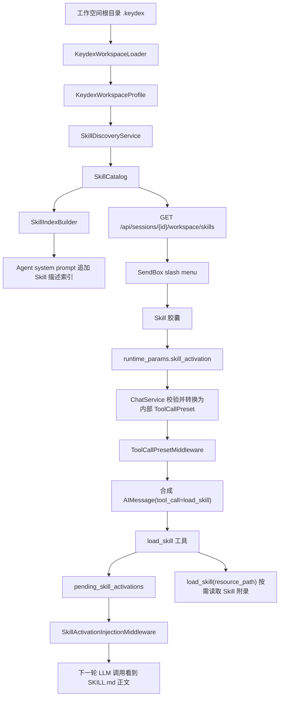
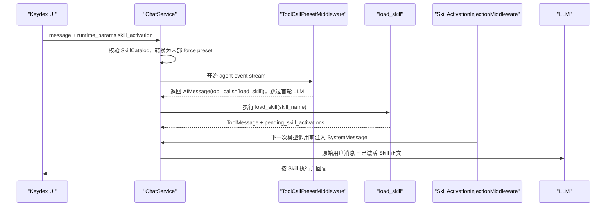
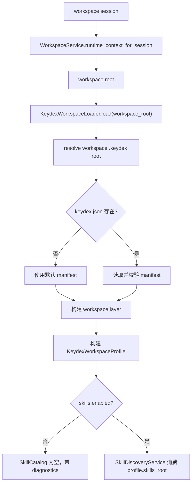
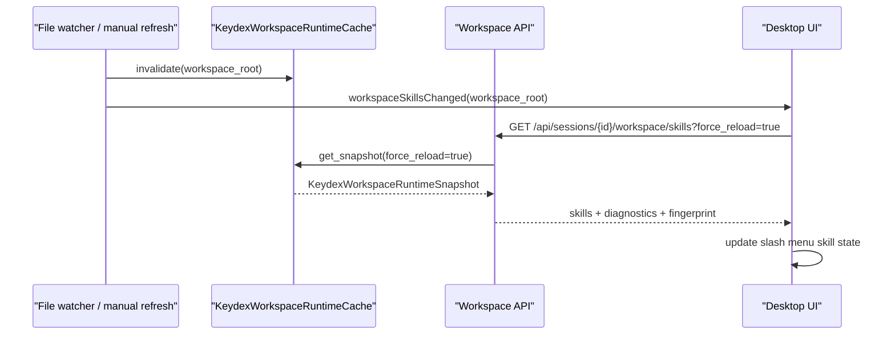
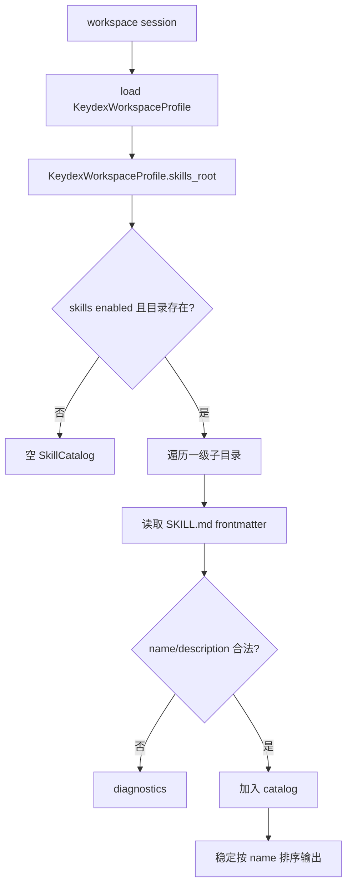
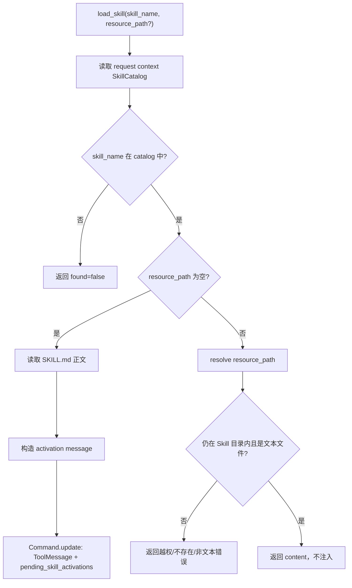

# DES-20260625-001-keydex-skill

| 字段 | 值 |
|------|-----|
| 文档编号 | DES-20260625-001-keydex-skill |
| 关联需求 | 对话需求：Keydex `.keydex` 工作空间 Skill 能力、`/skill` 胶囊、`load_skill` 与强制工具调用机制 |
| 创建日期 | 2026-06-25 |
| 负责人 | Keydex |
| 状态 | 草稿 |
| 最后更新 | 2026-06-25 |
| 需求类型 | 混合型 |

---

## 一、概述与阅读导航

### 1.1 设计目标

本设计为 Keydex 引入一套以 `.keydex` 为工作空间目录的 Skill 能力。目标不是简单把某个 `SKILL.md` 拼到系统提示词里，而是建立一套可渐进加载、可由 UI 显式触发、可被 Agent 自主触发、并能复用到未来其他 UI 驱动工具调用场景的运行时机制。

本期核心目标如下：

- 在工作空间根目录支持 `.keydex/skills/<skill-name>/SKILL.md`。
- 采用 Codex Skill 的文件结构与渐进式加载思想：索引阶段只暴露 `name` 与 `description`，触发后才加载 `SKILL.md` 正文，附录资源继续按需读取。
- 采用基座项目的 `load_skill` 激活思想：Agent 使用统一工具加载 Skill，加载成功后由中间件把 Skill 正文作为运行时系统消息注入。
- 采用基座项目的 `tool_call_preset force` 思想：当用户在 UI 里显式选择 `/skill` 时，后端强制 Agent 第一步调用 `load_skill`，从而让 `/skill` 与 agent 组装流程解耦。
- 前端把 `/skill` 渲染成类似引用片段的 Skill 胶囊，而不是保留在输入框文本中。

### 1.2 范围边界

#### 本次设计覆盖

- `.keydex/skills` 目录约定、Skill 元数据解析、名称校验与资源访问边界。
- `.keydex` 工作空间目录加载底座，包括根目录解析、manifest 读取、scope 模型、有效配置视图与 diagnostics。
- 工作空间 Skill 发现接口，用于前端 slash menu 展示。
- Skill index 拼接规则，仅拼接描述与触发说明，不拼接正文。
- `load_skill` 工具协议，包括 Skill 激活与附录资源读取。
- `ToolCallPresetMiddleware` 内部机制，一期仅由 `/skill` 显式触发生成 `load_skill` 的 force preset。
- `SkillActivationInjectionMiddleware` 与 `pending_skill_activations` 状态。
- 前端 `/skill` 选择、Skill 胶囊展示、发送 payload、历史回显。
- 安全边界、失败处理、测试与验收方案。

#### 本次明确不做

- 不支持系统级 `.keydex` 生效。系统级路径只预留 source 模型，不在一期加载。
- 不实现系统级 `.keydex` 与 workspace `.keydex` 的真实合并生效；但 loader、数据模型和优先级规则必须预留该层级。
- 不支持从 `.agents/skills`、`.codex/skills`、`.claude` 自动迁移或兼容读取。
- 不支持 Skill 安装、更新、市场、版本管理或远程仓库拉取。
- 不支持多个 Skill 胶囊同时激活。多 Skill 冲突优先级留到后续设计。
- 不开放通用 `runtime_params.tool_call_preset` 给前端。公开协议只允许 `skill_activation`。
- 不自动执行 Skill 目录下的 `scripts/`。本期只支持读取 Skill 正文和文本附录资源。
- 不新增数据库表结构。

### 1.3 设计原则

- 渐进式加载：Skill 描述常驻，正文触发后加载，附录继续按需加载。
- UI 与 Agent 解耦：`/skill` 是结构化运行时上下文，不是 prompt 文本。
- 公开协议收窄：前端只提交 Skill 激活意图，不提交任意工具调用。
- 单一运行时视图：Skill index、`load_skill`、resource 读取、`/skill` 胶囊都消费同一份 Skill catalog。
- 工作空间优先：一期只读取工作空间根目录 `.keydex`，不把当前 `cwd` 子目录当成 Skill 根。
- 最小侵入：复用现有 `runtime_params`、SendBox chip、message context items、LangChain middleware 与 tool registry 形态。

### 1.4 阅读建议

先看第二章理解整体链路；再看第四章的功能点设计，尤其是 4.3、4.4、4.5；最后看第五章的接口、状态和安全汇总。

---

## 二、需求整体总览视图

### 2.1 整体架构图



整体链路分成两条触发路径：

- 自动触发路径：Agent 看到 Skill index 后，根据用户任务主动调用 `load_skill(skill_name="...")`。
- 显式触发路径：用户通过 `/skill` 选择 Skill 胶囊，后端在第一步强制生成 `load_skill` 工具调用。

两条路径最终都进入同一个 `load_skill` 工具和同一个 Skill 激活注入机制。

### 2.2 显式 `/skill` 触发时序



### 2.3 功能点总表

| 功能点 | 目标 | 关键参与模块 | 关键数据/状态 | 是否需要详细时序 |
|--------|------|--------------|----------------|------------------|
| `.keydex` 加载底座与层级控制 | 先形成统一的工作空间配置视图，再让 Skill 消费该视图 | `KeydexWorkspaceLoader`、`WorkspaceService`、`request_context` | `KeydexWorkspaceProfile`、`KeydexScope`、diagnostics | 是 |
| `.keydex` Skill 目录与解析 | 建立工作空间 Skill 文件规范 | `backend/app/skills/*`、`WorkspaceService` | `SkillDefinition`、`SkillCatalog` | 否 |
| Skill index 拼接 | 让 Agent 知道可用 Skill 描述，但不加载正文 | `AgentRunner`、`SkillIndexBuilder` | `name`、`description`、`source` | 否 |
| `load_skill` 工具 | 统一激活 Skill 与读取附录 | `backend/app/tools/skill.py` | `pending_skill_activations`、`resource_path` | 是 |
| Skill 激活注入中间件 | 延迟把 Skill 正文注入 LLM 上下文 | `backend/app/agent/middleware.py` | `pending_skill_activations` | 是 |
| 强制工具调用中间件 | 支持 `/skill` 强制第一步加载 Skill | `ToolCallPresetMiddleware`、`request_context` | `ToolCallPreset` | 是 |
| `/skill` 胶囊 UI | 让 Skill 选择成为结构化上下文 | `SendBox`、`SlashCommandMenu`、`messageInjection` | `SelectedSkill`、`skill_activation` | 否 |
| 历史与事件回显 | 重新打开会话后仍看到 Skill 胶囊 | `MessageEventService`、`MessageText` | `contextItems.kind=skill` | 否 |
| 安全与失败处理 | 防止越权路径、任意工具执行、过大内容注入 | discovery、tool、middleware | whitelist、size limit、diagnostics | 否 |

### 2.4 核心链路串联说明

1. 工作空间会话启动或聊天发送前，后端先根据绑定工作空间根目录加载 `KeydexWorkspaceProfile`。
2. Skill discovery 消费 profile 中的 `skills_root`，形成统一 `SkillCatalog`，同时供 prompt index、`load_skill`、前端 skill 列表接口使用。
3. Agent 组装阶段只追加 Skill 描述索引，索引中指示模型需要使用 Skill 时调用 `load_skill`。
4. 用户显式选择 `/skill` 时，前端移除输入框中的 slash 片段，添加 Skill 胶囊，并通过 `runtime_params.skill_activation` 发送。
5. 后端把公开的 `skill_activation` 转换为内部 `ToolCallPreset(type="force", calls=[load_skill])`。
6. `ToolCallPresetMiddleware` 在首轮模型调用前返回合成 tool call，保证 `load_skill` 是第一步。
7. `load_skill` 成功后写入 `pending_skill_activations`，不直接打断当前工具消息序列。
8. `SkillActivationInjectionMiddleware` 在下一次模型调用前注入 `SKILL.md` 正文，Agent 再基于原始用户消息执行。

### 2.5 关键设计总览

| 设计主题 | 结论 | 原因 |
|----------|------|------|
| 一期 Skill 来源 | 只支持 `KeydexWorkspaceProfile.skills_root` 指向的工作空间 `.keydex/skills` | 避免系统级、项目级、当前 cwd 多层优先级过早复杂化 |
| `.keydex` 加载前提 | 必须先实现统一 `.keydex` loader，Skill 只消费 loader 输出 | 避免 Skill 自己硬编码目录解析，后续配置、系统级和其他能力无法统一 |
| 工作空间根目录定义 | 使用会话绑定 workspace root，不使用当前 `cwd` 子目录 | 防止在子目录会话中读取到不同 `.keydex`，造成同一项目视图不一致 |
| Codex 参考取舍 | 采用 `SKILL.md` 结构与渐进式加载，不采用“模型直接读文件路径”作为主机制 | Keydex 需要 UI 胶囊和后端统一激活协议 |
| 基座参考取舍 | 采用 `load_skill`、pending 注入、force preset；不复制 sandbox skill 存储复杂度 | Keydex 是本地工作空间项目，文件来源简单 |
| `/skill` 公开协议 | `runtime_params.skill_activation` | 避免前端拥有任意工具调用能力 |
| 内部执行协议 | 后端转换成 `ToolCallPreset.force(load_skill)` | 可复用基座强制工具调用机制 |
| 多 Skill | 一期禁止 | 多 Skill 指令冲突和注入顺序需要单独设计 |
| Skill 正文注入位置 | `load_skill` 后由 middleware 延迟注入 | 避免 SystemMessage 插入 tool call/tool result 中间 |

---

## 三、项目现状分析与设计约束

### 3.1 技术栈概览

| 层级 | 当前技术 | 版本来源 |
|------|----------|----------|
| 后端语言 | Python 3.11-3.12 | `pyproject.toml` |
| 后端框架 | FastAPI | `pyproject.toml` |
| Agent 框架 | LangChain 1.1+、LangGraph 1.0+ | `requirements.txt` |
| 后端模型接入 | `langchain-openai` | `pyproject.toml` |
| 前端框架 | React 19、TypeScript、Vite | `desktop/package.json` |
| 桌面壳 | Tauri 2 | `desktop/package.json` |
| 本地存储 | SQLite repository | `backend/app/storage/db.py` |

### 3.2 项目结构

```text
keydex/
├── backend/
│   ├── app/
│   │   ├── agent/
│   │   ├── api/
│   │   ├── core/
│   │   ├── services/
│   │   ├── storage/
│   │   └── tools/
│   └── tests/
├── desktop/
│   ├── src/runtime/
│   ├── src/renderer/components/chat/
│   ├── src/renderer/pages/conversation/
│   └── tests/
├── .agents/skills/
└── .keydex/                         # 本设计新增，运行时 Skill 来源
```

### 3.3 相关现有模块

| 模块名 | 位置 | 与本次设计的关系 |
|--------|------|------------------|
| Agent 组装 | `backend/app/agent/runner.py` | 当前创建 LangChain agent、转换工具、拼系统提示词，需要追加 Skill index |
| Agent middleware | `backend/app/agent/middleware.py` | 当前只有工具错误处理与重复工具保护，需要新增 model-call 与 before-model 中间件 |
| Agent factory | `backend/app/agent/factory.py` | 当前直接调用 `create_agent`，需要支持自定义 state schema |
| Tool adapter | `backend/app/agent/langchain_tools.py` | 当前把本地工具结果转成字符串；`load_skill` 需要支持 LangGraph `Command` 或使用专用 native tool |
| Tool registry | `backend/app/tools/factory.py` | 当前注册 filesystem/search/shell/patch/plan，需要注册或附加 `load_skill` |
| Tool context | `backend/app/tools/base.py` | 已包含 `workspace_root` 与 metadata，可承载 Skill catalog |
| Chat service | `backend/app/services/chat_service.py` | 当前解析 `runtime_params.message_injection`，需要解析 `skill_activation` 并设置 request context |
| Request context | `backend/app/core/request_context.py` | 当前只有 trace/session/user，需要增加 preset 和 Skill catalog ContextVar |
| WebSocket payload | `backend/app/api/websocket.py` | 已透传 `runtime_params` 或 `runtimeParams` |
| Workspace context | `backend/app/services/workspace_service.py` | 提供 workspace root/cwd/roots，是 `.keydex` 解析边界来源 |
| SendBox | `desktop/src/renderer/components/chat/SendBox/SendBox.tsx` | 已支持 slash menu、文件/引用 chip，需要增加 Skill chip |
| SlashCommandMenu | `desktop/src/renderer/components/chat/SlashCommandMenu` | 当前 slash command 静态且只有 clear，需要支持动态 Skill command |
| Message injection utils | `desktop/src/renderer/utils/messageInjection.ts` | 已把文件/引用转成 `runtime_params.message_injection`，可扩展 Skill runtime params |
| ConversationPage | `desktop/src/renderer/pages/conversation/ConversationPage.tsx` | 已将 `runtimeParams` 放入 chat payload |
| MessageEventService | `backend/app/services/message_event_service.py` | 已把 message injection 事件恢复成 contextItems，可扩展 Skill 胶囊历史恢复 |
| MessageText | `desktop/src/renderer/pages/conversation/messages/MessageText.tsx` | 已读取 user message 的 contextItems 展示上下文，可增加 Skill 类型样式 |

### 3.4 现有可复用能力

- `runtime_params` 已从前端 `ChatPayload` 传到 WebSocket 和 `ChatRequest`，本设计直接扩展。
- `message_injection` 已证明“输入文本”和“结构化上下文”可以分离。
- SendBox 已有文件/引用 chip 区域，可复用为 Skill 胶囊展示区域。
- 会话为 workspace 类型时，后端已能解析工作空间 root 与 cwd。
- LangChain middleware 已接入 agent 创建流程，可扩展 model-call 拦截。
- 本地工具 registry 和 LangChain tool adapter 已存在，`load_skill` 可复用工具事件、日志和错误处理风格。
- 历史消息已支持从事件恢复 contextItems，Skill 胶囊可沿用同一展示模型。

### 3.5 设计约束

- `runtime_params` 必须保持向后兼容，不能破坏现有 `message_injection`。
- `chat` 类型 session 当前禁用工具，本期 Skill 只在 `workspace` session 生效。
- Skill 目录只能在工作空间根目录下发现，不能随 `cwd` 漂移。
- `load_skill` 读取路径必须被限制在当前 Skill 目录内。
- Skill 正文和资源内容来自工作空间文件，必须视为不可信内容；它们是任务指令来源，但不能越过 Keydex 系统提示词和工具安全边界。
- 当前项目没有 `PyYAML` 依赖，Skill frontmatter 解析应优先实现小型 YAML 子集解析，避免为 `name`/`description` 引入新依赖。
- `.ktaicoding/CONSTITUTION.md` 当前未配置有效内容，本设计不声明额外宪法条款。

### 3.6 外部参考结论

#### Codex 方案参考

Codex Skill 的核心是文件结构和渐进式披露：

- Skill 入口为 `SKILL.md`。
- YAML frontmatter 至少包含 `name` 和 `description`。
- `name + description` 出现在可用 Skill 列表中。
- 当模型判断需要使用某 Skill 时，再读取 `SKILL.md` 正文。
- `references/`、`scripts/`、`assets/` 等资源继续按需打开，不在初始 prompt 中全量注入。

从 Codex 源码看，Skill 列表展示不是在输入 `/`、`@` 或 `$` 时临时扫磁盘，而是在启动/会话配置后通过 `skills/list` 扫描并固化到运行时状态：后端 `SkillsManager` 按 cwd 或有效配置缓存 `SkillLoadOutcome`，前端把响应写入 composer 的 skill mention state；后续通过 file watcher 或配置变更清 cache 并通知前端刷新。这一点对 Keydex 很关键：`.keydex` 能力也应形成工作空间级运行时快照，而不是让 Skill、prompt、`/skill` UI 各自独立读目录。

Keydex 采用这套文件与渐进式披露模型，但不让模型直接依赖文件路径读取 Skill，而是通过 `load_skill` 统一激活。

#### 基座方案参考

基座项目提供三块可复用思想：

- `skill_assembler.build_index(...)`：Skill index 中明确告诉 Agent 使用时调用 `load_skill(skill_name="...")`。
- `load_skill` 工具：校验当前会话绑定 Skill，读取 `SKILL.md`，构造 activation messages，并写入 `pending_skill_activations`。
- `ToolCallPresetMiddleware`：`force` 模式合成 `AIMessage(tool_calls=[...])` 并跳过首轮 LLM；`guide` 模式通过 `tool_choice` 引导模型调用工具。

Keydex 采用 `force` 模式用于显式 `/skill`，因为 Skill 名称由 UI 选择确定，不需要模型再推断参数。

### 3.7 功能点参考实现追踪矩阵

本节是后续 `/dev-plan` 与 Issues CSV 的强约束输入。拆 Issue 时，每个 Issue 至少要同步写明 `feature_id`、`reference_project`、`reference_code`、`reference_chain`、`keydex_target`；如果某个实现点没有直接参考项目，必须写明 `无直接参考，按本 DES 设计实现`。禁止只写“参考 Codex”或“参考基座”这种泛称。

#### 3.7.1 工作空间与 Skill 发现链路

| 功能 ID | 功能点 | 参考项目与具体内容 | 参考代码位置 | 参考链路 | Keydex 落点 |
|------|------|------|------|------|------|
| F-WS-01 | `.keydex` 工作空间 Profile 与层级模型 | Codex 配置层按 home/project/cwd 组装有效配置；AGENTS.md 按 project root 到 cwd 分层加载。Keydex 只借鉴“统一加载视图”，本期产品层级只启用 workspace。 | Codex `codex-rs/config/src/loader/mod.rs:116`, `codex-rs/config/src/loader/mod.rs:1190`, `codex-rs/config/src/state.rs:483`, `codex-rs/core/src/agents_md.rs:167` | 启动/会话上下文 -> 加载配置层 -> 生成 effective config -> 后续能力只消费有效视图 | 新增 `backend/app/keydex/profile.py`；复用 `backend/app/services/workspace_service.py:40`, `backend/app/services/workspace_service.py:119` 获取 session workspace root |
| F-WS-02 | 工作空间运行时快照与缓存 | Codex `SkillsManager` 按 cwd/config 缓存 `SkillLoadOutcome`，`skills/list` 支持 `force_reload`，文件 watcher 清 cache 并发 `SkillsChanged`。 | Codex `codex-rs/core-skills/src/manager.rs:52`, `codex-rs/core-skills/src/manager.rs:145`, `codex-rs/core-skills/src/manager.rs:196`, `codex-rs/app-server/src/request_processors/catalog_processor.rs:498`, `codex-rs/app-server/src/request_processors/catalog_processor.rs:563`, `codex-rs/app-server/src/skills_watcher.rs:145` | workspace root -> runtime snapshot -> backend memory cache -> `force_reload` 重建 -> watcher/fingerprint 失效通知 | 新增 `KeydexWorkspaceRuntimeSnapshot`、`KeydexWorkspaceRuntimeCache`；挂到 `backend/app/services/workspace_service.py:119` 后的 session workspace 链路 |
| F-SK-01 | `.keydex/skills/*/SKILL.md` 发现与 frontmatter 解析 | Codex 以 roots 为输入做有界扫描，识别 `SKILL.md` 并解析 metadata。Keydex 只扫描 workspace `.keydex/skills`，不启用用户全局和 cwd 子目录漂移。 | Codex `codex-rs/core-skills/src/loader.rs:125`, `codex-rs/core-skills/src/loader.rs:163`, `codex-rs/core-skills/src/loader.rs:235`, `codex-rs/core-skills/src/loader.rs:639` | workspace profile -> skill roots -> bounded scan -> parse `SKILL.md` -> diagnostics + catalog | 新增 `backend/app/keydex/skills/loader.py`、`backend/app/keydex/skills/model.py`；路径边界复用 `backend/app/security/workspace.py:53` 的 workspace path 思路 |
| F-SK-02 | Skill 列表 API 与 UI 本地状态 | Codex TUI 启动后异步 `skills/list(force_reload=true)`，响应写入 composer skill state，输入弹窗只消费已加载状态。 | Codex `codex-rs/tui/src/app/background_requests.rs:118`, `codex-rs/tui/src/app/background_requests.rs:706`, `codex-rs/tui/src/app/background_requests.rs:718`, `codex-rs/tui/src/chatwidget/skills.rs:154`, `codex-rs/tui/src/bottom_pane/chat_composer.rs:369`, `codex-rs/tui/src/bottom_pane/chat_composer.rs:569`, `codex-rs/tui/src/bottom_pane/chat_composer.rs:3727` | session/workspace 打开 -> 请求 skill catalog -> 写入前端 state -> `/skill` 弹窗按 state 渲染 | 新增 `GET /api/sessions/{session_id}/workspace/skills`；参考现有 session workspace API `backend/app/api/workspace.py:287`, `backend/app/api/workspace.py:621`, `backend/app/api/workspace.py:639`；前端扩展 `desktop/src/runtime/workspace.ts:105`, `desktop/src/runtime/workspace.ts:186` |
| F-SK-03 | Prompt 中 Skill description 渐进式索引 | Codex 只把 skill `name + description + locator` 渲染进 available skills；基座 `skill_assembler.build_index` 在索引中要求模型使用 `load_skill(skill_name=...)`。Keydex 使用“metadata 索引 + load_skill 激活”，不把正文直接拼进初始 prompt。 | Codex `codex-rs/core-skills/src/render.rs:25`, `codex-rs/core-skills/src/render.rs:160`, `codex-rs/core/src/session/mod.rs:2979`; 基座 `agent_backend/engine/skill_assembler.py:8`, `agent_backend/engine/skill_assembler.py:29` | skill snapshot -> skill index prompt fragment -> 模型看到 description -> 需要时调用 `load_skill` | 新增 `backend/app/keydex/skills/prompt.py`；接入现有 system prompt/agent 组装链路 `backend/app/agent/runner.py:53`, `backend/app/agent/runner.py:84` |

#### 3.7.2 Skill 激活、强制工具调用与前端胶囊链路

| 功能 ID | 功能点 | 参考项目与具体内容 | 参考代码位置 | 参考链路 | Keydex 落点 |
|------|------|------|------|------|------|
| F-SK-04 | `load_skill` 工具 | 基座 `load_skill` 负责校验会话绑定 Skill、读取 `SKILL.md` 或附录资源、返回 activation，并把待注入消息写入 `pending_skill_activations`。 | 基座 `agent_backend/tools/load_skill.py:85`, `agent_backend/tools/load_skill.py:222`, `agent_backend/tools/load_skill.py:230`, `agent_backend/tools/skill_activation_messages.py:15` | tool call -> validate skill binding -> read main/resource -> build activation messages -> return structured result | 新增 `backend/app/tools/skill.py` 并注册到 `backend/app/tools/factory.py:12`；工具上下文复用 `backend/app/tools/base.py:39` |
| F-SK-05 | Skill activation pending state 与注入中间件 | 基座将 `load_skill` 产物先写 state，再由 `SkillActivationInjectionMiddleware` 统一注入 messages，注入后 reset，避免并发工具调用直接改消息列表。 | 基座 `agent_backend/engine/agent_state.py:34`, `agent_backend/engine/agent_state.py:79`, `agent_backend/engine/agent_state.py:112`, `agent_backend/middleware/skill_activation_injection.py:28`, `agent_backend/middleware/skill_activation_injection.py:47`, `agent_backend/middleware/skill_activation_injection.py:97` | `load_skill` result -> `pending_skill_activations` -> middleware before model -> append SystemMessage/ToolMessage -> reset pending | 新增 `backend/app/agent/skill_state.py`、`backend/app/agent/skill_activation_middleware.py`；接入 `backend/app/agent/middleware.py:84` 和 `backend/app/agent/runner.py:93` |
| F-SK-06 | `/skill` 不留在输入框，转为可视胶囊与 `runtime_params.skill_activation` | Keydex 现有选中文件/片段已经通过 `contextItems + runtimeParams.message_injection` 做“输入框外的胶囊状态”。本功能沿用该 UI 模式，但字段改为 `skill_activation`，不走 prompt 组装阶段直接转文本。 | Keydex `desktop/src/renderer/utils/messageInjection.ts:12`, `desktop/src/renderer/utils/messageInjection.ts:34`, `desktop/src/renderer/utils/messageInjection.ts:39`, `desktop/src/renderer/pages/conversation/ConversationPage.tsx:452`, `desktop/src/renderer/pages/conversation/ConversationPage.tsx:485`, `desktop/src/renderer/pages/conversation/ConversationPage.tsx:489`, `desktop/src/renderer/pages/conversation/messages/MessageText.tsx:71`, `desktop/src/renderer/pages/conversation/messages/MessageText.tsx:162` | `/skill` 选择 -> composer state 生成 skill capsule -> send payload 带 `runtime_params.skill_activation` -> history 渲染 capsule | 扩展 `desktop/src/renderer/components/chat/SendBox/SendBox.tsx:95`, `desktop/src/renderer/components/chat/SendBox/SendBox.tsx:520`, `desktop/src/renderer/components/chat/SlashCommandMenu/SlashCommandMenu.tsx:6`；新增 `SkillContextItem` 渲染到 `MessageText.tsx:209` |
| F-SK-07 | 强制 Agent 首步调用 `load_skill` | 基座 `ToolCallPresetMiddleware` 的 `force` 模式合成 tool_calls 并跳过首轮 LLM；`guide` 模式只引导。Keydex 显式 `/skill` 使用 `force`，因为 skill_name 已由 UI 选定。 | 基座 `common/schemas/tool_call_preset.py:34`, `common/schemas/tool_call_preset.py:40`, `common/core/request_context.py:64`, `common/core/request_context.py:154`, `common/core/request_context.py:172`, `agent_backend/middleware/tool_call_preset_middleware.py:28`, `agent_backend/middleware/tool_call_preset_middleware.py:96`, `agent_backend/middleware/tool_call_preset_middleware.py:101`, `agent_backend/middleware/tool_call_preset_middleware.py:124` | `runtime_params.skill_activation` -> backend 转内部 preset -> middleware 消费 preset -> synthetic `load_skill` tool_call -> 正常工具执行链路 | 新增 `backend/app/agent/tool_call_preset_middleware.py`、`backend/app/core/tool_call_preset_context.py`；接入 `backend/app/agent/factory.py:312`, `backend/app/agent/factory.py:321` |
| F-SK-08 | Chat runtime params 解耦入口 | 基座在 chat service 中从 `runtime_params` 提取 `tool_call_preset` 并写入 request context；Keydex 已有 `runtime_params.message_injection` 校验和注入，适合新增 `skill_activation` 解析。 | 基座 `agent_backend/services/chat_service.py:226`, `agent_backend/services/chat_service.py:759`; Keydex `backend/app/services/chat_service.py:70`, `backend/app/services/chat_service.py:77`, `backend/app/services/chat_service.py:100`, `backend/app/services/chat_service.py:239`, `backend/app/services/chat_service.py:305`, `backend/app/services/chat_service.py:693` | websocket/http payload -> `ChatRequest.runtime_params` -> validate/extract skill activation -> set internal preset/context -> agent run | 扩展 `backend/app/services/chat_service.py:100` 附近 runtime params parsing；websocket 入口复用 `backend/app/api/websocket.py:183`, `backend/app/api/websocket.py:286` |
| F-SK-09 | Agent 工具注册与中间件装配 | 基座把 `ToolCallPresetMiddleware` 放在 `SkillActivationInjectionMiddleware` 前；Keydex 现有 agent runner 已集中完成 tools 和 middleware 装配。 | 基座 `agent_backend/engine/agent_factory.py:315`, `agent_backend/engine/agent_factory.py:316`; Keydex `backend/app/agent/runner.py:74`, `backend/app/agent/runner.py:88`, `backend/app/agent/runner.py:93`, `backend/app/agent/factory.py:312`, `backend/app/agent/factory.py:321`, `backend/app/tools/factory.py:14` | create tools -> create agent -> middleware order: preset force -> tool execution -> skill activation injection -> model continuation | 修改 `backend/app/tools/factory.py:12` 注册 `load_skill`；修改 `backend/app/agent/middleware.py:84` 默认中间件顺序 |
| F-SK-10 | 会话历史回填 Skill 胶囊 | Keydex 现有 message event service 会把 `message_injection` 事件转回 user message 的 `contextItems`，前端消息区按 `contextItems` 渲染胶囊。Skill 胶囊应复用这条“用户可见上下文”语义，但不把 skill 正文写入历史。 | Keydex `backend/app/services/message_event_service.py:36`, `backend/app/services/message_event_service.py:250`, `desktop/src/renderer/pages/conversation/messages/MessageText.tsx:403`, `desktop/src/renderer/pages/conversation/messages/MessageText.tsx:217` | send skill capsule -> persist user payload/context item -> history load -> render selected skill capsule -> actual activation 由 tool trace 体现 | 扩展 user message payload 的 `contextItems` 类型；新增 skill item renderer，不改 `message_injection` 的 follow/slot 语义 |
| F-SK-11 | Skill 资源安全边界 | Codex 强制通过 `SKILL.md` 入口和 locator 描述资源来源；基座附录文件必须通过 `load_skill(resource_path=...)` 读取。Keydex workspace skill 来自项目文件，必须限制在 skill 目录内，并设置大小/类型限制。 | Codex `codex-rs/core-skills/src/render.rs:25`; 基座 `agent_backend/tools/skill_activation_messages.py:15`, `common/common_service/skill_service.py:216`; Keydex `backend/app/api/workspace.py:812`, `backend/app/tools/filesystem.py:347`, `backend/app/tools/search.py:444`, `backend/app/tools/patch.py:520` | skill main/resource path -> normalize/resolve -> must stay under active skill dir -> size/type guard -> diagnostics/error | 新增 `backend/app/keydex/skills/security.py`；禁止 `load_skill` 读取 workspace 任意文件或执行 skill 内脚本 |

#### 3.7.3 Plan 与 Issues CSV 同步规则

后续生成开发计划和 Issues CSV 时，必须把上表同步为开发合同的一部分：

| CSV 字段 | 必填 | 说明 |
|------|------|------|
| `feature_id` | 是 | 使用上表 `F-WS-*` / `F-SK-*` 编号；一个 Issue 涉及多个功能点时用 `;` 分隔 |
| `reference_project` | 是 | `Codex`、`基座`、`Keydex现有` 或 `无直接参考` |
| `reference_code` | 是 | 必须包含文件路径和行号，例如 `codex-rs/core-skills/src/manager.rs:145` |
| `reference_chain` | 是 | 用一句话写清参考链路，不能只写函数名 |
| `keydex_target` | 是 | 写清将要新增/修改的 Keydex 文件、函数或接口 |

跨模块 Issue 还必须满足两条约束：

- 涉及 `F-WS-02`、`F-SK-01`、`F-SK-02` 的 Issue 必须说明消费同一个 `KeydexWorkspaceRuntimeSnapshot`，避免 API、prompt、UI 各自扫描 `.keydex/skills`。
- 涉及 `F-SK-06`、`F-SK-07`、`F-SK-08` 的 Issue 必须说明 `/skill` UI 字段只进入 `runtime_params.skill_activation`，由后端转换为内部 force preset；不得把 `tool_call_preset` 作为公共 UI/API 协议直接暴露。

---

## 四、功能点详细设计

### 4.0 `.keydex` 工作空间目录加载与层级控制

#### 4.0.1 功能目标与边界

实现 `.keydex/skills` 的前提，是先有一套统一的 `.keydex` 工作空间目录加载能力。Skill 不应直接在自己的 discovery 里硬编码扫描 `<workspace_root>/.keydex/skills`，而应消费一个已经解析完成的 Keydex 工作空间配置视图。

本期要实现的是“完整加载架构的最小生效集”：

- 代码层面建立 `.keydex` scope、root resolver、manifest reader、profile builder、diagnostics。
- 运行时只启用 workspace scope。
- system scope 只进入模型和优先级设计，不实际读取生效。
- Skill 作为 `.keydex` 的第一个消费者接入。

这意味着本期不是只做一个 `discover_skills(workspace_root)` 工具函数，而是要先做：

```text
workspace session
  -> resolve workspace root
  -> load .keydex profile
  -> build workspace runtime snapshot
  -> profile.skills_root
  -> discover skills
  -> build SkillCatalog
  -> cache snapshot for prompt/UI/tool validation
```

#### 4.0.2 `.keydex` 目录结构

本期推荐的工作空间目录结构：

```text
<workspace_root>/
└── .keydex/
    ├── keydex.json
    └── skills/
        └── skill-name/
            ├── SKILL.md
            ├── references/
            ├── scripts/
            └── assets/
```

`keydex.json` 本期是可选文件。没有该文件时，默认认为 `.keydex` 存在但只有默认配置。

最小 manifest 示例：

```json
{
  "schema_version": 1,
  "skills": {
    "enabled": true
  }
}
```

本期只读取已知字段：

| 字段 | 类型 | 默认值 | 说明 |
|------|------|--------|------|
| `schema_version` | number | `1` | `.keydex` manifest schema 版本 |
| `skills.enabled` | boolean | `true` | 是否启用当前 workspace 的 Skill 发现 |

未知字段本期不报错，只进入 diagnostics warning，避免未来配置扩展时破坏旧版本。

#### 4.0.3 层级模型

产品语义上只有两层：

| 层级 | 本期状态 | 未来用途 |
|------|----------|----------|
| `system` | 预留，不读取 | 用户全局 Keydex 配置与全局 Skill |
| `workspace` | 启用 | 当前工作空间 `.keydex` 配置与 Skill |

内部可以有更多默认层，但不要暴露给用户：

```text
Keydex compiled defaults
  < system .keydex      # 本期不启用
  < workspace .keydex   # 本期启用
  < per-turn runtime_params
```

这里的 `<` 表示后者优先级更高。但要注意：`runtime_params` 不是配置文件层，它只表达“本轮选择/激活什么”，不得反向修改 `.keydex` 配置。

#### 4.0.4 有效配置视图

新增模型：

```python
KeydexScope = Literal["workspace", "system"]

@dataclass(frozen=True)
class KeydexLayer:
    scope: KeydexScope
    root: Path
    enabled: bool
    manifest: dict[str, Any]
    diagnostics: list[KeydexDiagnostic]

@dataclass(frozen=True)
class KeydexWorkspaceProfile:
    workspace_root: Path
    keydex_root: Path
    active_layers: list[KeydexLayer]
    skills_root: Path | None
    skills_enabled: bool
    diagnostics: list[KeydexDiagnostic]
```

本期 `active_layers` 只会包含 workspace layer。未来 system scope 启用后，profile builder 负责合并 system + workspace，而 Skill discovery 仍只消费 profile 输出，不需要知道多层合并细节。

#### 4.0.5 关键流程



#### 4.0.6 伪代码

```python
def load_keydex_workspace_profile(workspace_root: Path) -> KeydexWorkspaceProfile:
    resolved_root = workspace_root.expanduser().resolve()
    keydex_root = resolved_root / ".keydex"
    manifest_path = keydex_root / "keydex.json"
    diagnostics = []

    manifest = {"schema_version": 1, "skills": {"enabled": True}}
    if manifest_path.is_file():
        try:
            manifest = merge_defaults(manifest, read_json(manifest_path))
        except KeydexManifestError as exc:
            diagnostics.append(KeydexDiagnostic(path=".keydex/keydex.json", reason=str(exc)))
            manifest["skills"]["enabled"] = False

    layer = KeydexLayer(
        scope="workspace",
        root=keydex_root,
        enabled=keydex_root.exists(),
        manifest=manifest,
        diagnostics=diagnostics,
    )
    skills_enabled = bool(manifest.get("skills", {}).get("enabled", True))
    return KeydexWorkspaceProfile(
        workspace_root=resolved_root,
        keydex_root=keydex_root,
        active_layers=[layer],
        skills_root=keydex_root / "skills" if skills_enabled else None,
        skills_enabled=skills_enabled,
        diagnostics=diagnostics,
    )
```

#### 4.0.7 与现有项目关联

- 复用：`WorkspaceService.runtime_context_for_session(...)` 作为 workspace root 的唯一来源。
- 新增：`backend/app/keydex/profile.py` 或 `backend/app/workspace_config/keydex_profile.py`。
- 修改：ChatService 在 workspace session 下先加载 `KeydexWorkspaceProfile`，再构建 Skill catalog。
- 修改：Skill discovery 的输入从 `workspace_root` 改为 `KeydexWorkspaceProfile`。
- 修改：request context 同时保存 `keydex_profile` 与 `skill_catalog`。

#### 4.0.8 边界与失败处理

| 场景 | 处理 |
|------|------|
| `.keydex` 不存在 | profile 正常返回，`skills_root=None` 或空 catalog |
| `.keydex/keydex.json` 不存在 | 使用默认 manifest |
| `keydex.json` JSON 解析失败 | diagnostics 记录错误，本期禁用 workspace `.keydex` 下能力，避免半解析状态 |
| `skills.enabled=false` | 不扫描 `.keydex/skills`，列表接口返回空 skills |
| workspace root 不存在或越权 | 仍由现有 `WorkspaceService` 报错 |
| system scope 未启用 | 不读取系统路径，只在模型和文档中保留优先级 |

#### 4.0.9 工作空间运行时快照

参考 Codex 的做法，Keydex 应在 workspace session 维度固化一份 `.keydex` 运行时视图。这个视图不是持久快照文件，而是后端内存中的 `KeydexWorkspaceRuntimeSnapshot`，作为 prompt index、前端 Skill 列表、`load_skill` 校验、`/skill` 强制工具调用的共同来源。

新增模型：

```python
@dataclass(frozen=True)
class KeydexWorkspaceRuntimeSnapshot:
    workspace_root: Path
    keydex_profile: KeydexWorkspaceProfile
    skill_catalog: SkillCatalog
    fingerprint: str
    loaded_at: datetime
    diagnostics: list[KeydexDiagnostic]

@dataclass(frozen=True)
class KeydexWorkspaceFingerprint:
    workspace_root: Path
    keydex_json_mtime_ns: int | None
    skills_dir_mtime_ns: int | None
    skill_entry_fingerprints: tuple[tuple[str, int, int], ...]
```

`fingerprint` 用于判断内存快照是否仍然有效，不需要写入数据库。本期可以只基于以下内容计算：

- workspace root 绝对路径。
- `.keydex/keydex.json` 的 mtime 与 size。
- `.keydex/skills` 目录 mtime。
- 每个 `SKILL.md` 的相对路径、mtime、size。

本期不把 `references/`、`scripts/`、`assets/` 纳入 catalog fingerprint。它们属于 `load_skill(resource_path)` 的按需资源，读取时实时校验路径和大小即可。只有 `SKILL.md` 的新增、删除、改名、frontmatter 变化会影响列表、prompt index 和 `/skill` UI。

#### 4.0.10 加载时机

工作空间加载分为三类时机：

| 时机 | 动作 | 是否强制重载 | 目的 |
|------|------|--------------|------|
| workspace session 打开/切换后 | 后台加载 `KeydexWorkspaceRuntimeSnapshot` 并返回 Skill 列表给前端 | 是 | 让 `/skill` 菜单和胶囊选择使用固化列表 |
| chat 发送前 | 获取当前 workspace snapshot；若 cache 有效则复用，否则重建 | 否 | 让 prompt index、`skill_activation` 校验、工具上下文一致 |
| 用户手动刷新/文件变更通知 | 清理当前 workspace snapshot cache，并触发前端重新拉取列表 | 是 | 保证 `.keydex` 修改能反映到 UI 和下一轮 chat |

启动后的首次 workspace skill list 不应阻塞主 UI 渲染。前端可以先展示没有 Skill 的 slash menu，等后台接口返回后再更新候选项。这与 Codex 的启动策略一致：首帧先出现，Skill metadata 异步填充。

#### 4.0.11 后端缓存与失效

新增 `KeydexWorkspaceRuntimeCache`，放在后端进程内存中：

```python
class KeydexWorkspaceRuntimeCache:
    def get_snapshot(self, workspace_root: Path, *, force_reload: bool = False) -> KeydexWorkspaceRuntimeSnapshot:
        ...

    def invalidate(self, workspace_root: Path) -> None:
        ...

    def invalidate_all(self) -> None:
        ...
```

缓存 key 为规范化后的 `workspace_root`。`get_snapshot(..., force_reload=False)` 的逻辑：

1. 读取当前 fingerprint。
2. 若缓存存在且 fingerprint 一致，返回缓存快照。
3. 若缓存不存在、`force_reload=True` 或 fingerprint 不一致，重新加载 profile 与 skill catalog。
4. 把新的 snapshot 写回 cache。

失效来源：

- `.keydex/keydex.json` 写入、删除或解析失败恢复。
- `.keydex/skills/**/SKILL.md` 新增、删除、修改。
- workspace session 切换到新的 workspace root。
- 用户手动刷新 workspace tree 或 Skill 列表。
- 后续启用 system scope 后，系统级 `.keydex` 发生变化。

本期不需要持久化 cache，也不需要把 snapshot 写入数据库。历史消息只保存用户当时选择的 Skill 胶囊信息；重新打开会话时，若当前 workspace 已没有该 Skill，历史仍可展示胶囊，但再次发送不能激活不存在的 Skill。

#### 4.0.12 文件监听与前端同步

为避免前端长期持有过期 Skill 列表，后端应提供 workspace 级变更通知。实现方式可以先复用现有 workspace tree 刷新通道；如果已有文件监听能力，则注册以下路径：

```text
<workspace_root>/.keydex/keydex.json
<workspace_root>/.keydex/skills/**/SKILL.md
```

变更处理流程：



如果本期暂不接文件 watcher，必须至少支持：

- 打开 workspace session 后自动拉取一次。
- 用户手动刷新 workspace tree 时强制刷新 skill list。
- chat 发送前后端用 snapshot cache 自校验，不能只信任前端旧列表。

#### 4.0.13 前端运行时状态

前端需要保存一份 workspace 当前 Skill 列表，用于 `/skill` 菜单展示，而不是每次打开 slash menu 都请求后端。

建议状态模型：

```ts
interface WorkspaceSkillState {
  workspaceRoot: string;
  skills: WorkspaceSkillSummary[];
  diagnostics: KeydexDiagnostic[];
  fingerprint: string | null;
  status: "idle" | "loading" | "ready" | "error";
  loadedAt: number | null;
}
```

状态更新规则：

- workspace session 打开后，进入 `loading` 并请求 Skill 列表。
- 请求成功后进入 `ready`，slash menu 使用本地 `skills`。
- 收到 `workspaceSkillsChanged` 或用户手动刷新后，重新进入 `loading` 并请求 `force_reload=true`。
- 如果请求失败，保留旧列表但状态标记为 `error`，slash menu 可继续显示旧结果并在发送时依赖后端校验。
- 发送带 `skill_activation` 的消息时，只提交 `skill_name/source/origin`，不提交 `SKILL.md` 路径作为信任来源。

---

### 4.1 `.keydex` Skill 目录与发现

#### 4.1.1 功能目标与边界

在工作空间根目录引入 Keydex 专属目录：

```text
.keydex/
└── skills/
    └── dev-plan/
        ├── SKILL.md
        ├── references/
        ├── scripts/
        ├── assets/
        └── agents/
            └── openai.yaml
```

本期只识别：

- `.keydex/skills/<directory>/SKILL.md`
- `SKILL.md` frontmatter 中的 `name`
- `SKILL.md` frontmatter 中的 `description`
- Skill 目录下的文本附录资源

本期不识别系统级 `.keydex`，但内部模型预留 `source` 字段。

#### 4.1.2 触发方式 / 入口

Skill 发现由三类场景触发：

- 前端打开 workspace session 后请求 Skill 列表。
- ChatService 处理一轮 workspace chat 前构建 Skill catalog。
- `load_skill` 工具运行时读取当前 request context 中的 Skill catalog。

#### 4.1.3 核心逻辑

新增后端包：

```text
backend/app/skills/
├── __init__.py
├── models.py
├── discovery.py
├── frontmatter.py
└── prompt.py
```

核心对象：

```python
@dataclass(frozen=True)
class SkillDefinition:
    name: str
    description: str
    source: Literal["workspace", "system"]
    root_dir: Path
    entry_file: Path
    relative_entry: str
    resources: list[str]

@dataclass(frozen=True)
class SkillCatalog:
    keydex_profile: KeydexWorkspaceProfile
    skills: dict[str, SkillDefinition]
    diagnostics: list[SkillDiagnostic]
```

发现规则：

1. 根据 workspace session 获取 `KeydexWorkspaceProfile`。
2. 若 `profile.skills_enabled=false` 或 `profile.skills_root=None`，返回空 catalog 与 profile diagnostics。
3. 只扫描 `profile.skills_root/*/SKILL.md`。
4. 每个一级子目录代表一个 Skill 候选。
5. 解析 `SKILL.md` 开头 `---` 包裹的 frontmatter。
6. `name` 必须存在、非空、匹配 `^[A-Za-z0-9_-]{1,64}$`。
7. `description` 必须存在、非空，建议限制在 2000 字符内。
8. `name` 必须与目录名一致。否则该 Skill 标记为 invalid，不进入 catalog。
9. 同名重复时，同 source 内保留第一个稳定排序结果，其余进入 diagnostics；一期因为目录名唯一，主要防 frontmatter 不一致。

#### 4.1.4 关键流程



#### 4.1.5 伪代码

```python
def discover_workspace_skills(profile: KeydexWorkspaceProfile) -> SkillCatalog:
    skills_dir = profile.skills_root
    if not profile.skills_enabled or skills_dir is None:
        return SkillCatalog(keydex_profile=profile, skills={}, diagnostics=profile.diagnostics)
    if not skills_dir.is_dir():
        return SkillCatalog(keydex_profile=profile, skills={}, diagnostics=profile.diagnostics)

    result = {}
    diagnostics = []
    for entry in sorted(skills_dir.iterdir(), key=lambda p: p.name.lower()):
        skill_md = entry / "SKILL.md"
        if not entry.is_dir() or not skill_md.is_file():
            continue
        try:
            metadata = parse_skill_frontmatter(skill_md)
            name = validate_skill_name(metadata["name"])
            description = validate_description(metadata["description"])
            if name != entry.name:
                raise SkillDefinitionError("frontmatter name must match directory name")
            result[name] = SkillDefinition(...)
        except SkillDefinitionError as exc:
            diagnostics.append(SkillDiagnostic(path=relative_path(skill_md), reason=str(exc)))
    return SkillCatalog(keydex_profile=profile, skills=result, diagnostics=[*profile.diagnostics, *diagnostics])
```

#### 4.1.6 数据结构

```json
{
  "name": "dev-plan",
  "description": "基于设计文档生成开发计划和 issues",
  "source": "workspace",
  "locator": ".keydex/skills/dev-plan/SKILL.md"
}
```

#### 4.1.7 与现有项目关联

- 复用：`WorkspaceService.runtime_context_for_session(...)` 提供 workspace root 与 cwd，`KeydexWorkspaceLoader` 提供 profile。
- 新增：`backend/app/skills/discovery.py`。
- 修改：ChatService 在加载 `KeydexWorkspaceProfile` 后解析 Skill catalog，并写入 request context 与 tool context metadata。

#### 4.1.8 边界与失败处理

- profile 中 `skills_enabled=false`：返回空列表，不报错。
- `.keydex/skills` 不存在：返回空列表，不报错。
- 某个 Skill 缺少 `SKILL.md`：跳过。
- frontmatter 缺字段：该 Skill invalid，列表接口可返回 diagnostics。
- `description` 太长：截断用于 index，但 `load_skill` 仍读取原始 `SKILL.md` 正文。
- 路径中出现 symlink：读取时必须 resolve，并确认最终路径仍在 Skill 目录内。

---

### 4.2 Skill index 拼接与渐进式加载

#### 4.2.1 功能目标与边界

Agent 组装阶段只把可用 Skill 的描述索引追加到系统提示词中，不注入 `SKILL.md` 正文。这样保留 Codex 的渐进式加载优势，也避免工作空间中存在大量 Skill 时膨胀 prompt。

#### 4.2.2 触发方式 / 入口

每轮 workspace chat 创建 agent 前执行：

1. 发现 Skill catalog。
2. 构建 Skill index 文本。
3. 追加到系统提示词末尾。
4. 同时保证 `load_skill` 工具在工具列表内。

#### 4.2.3 核心逻辑

新增 `SkillIndexBuilder`：

```text
<keydex_skills>
当前工作空间可用 Keydex Skills 如下。
当用户明确点名某个 skill，或任务与 description 明显匹配时，先调用 load_skill(skill_name="...")。
不要猜测 Skill 正文；load_skill 成功后再按注入内容执行。
当用户通过 /skill 显式选择 Skill 时，系统会自动完成第一步 load_skill，你不需要重复加载。

1. dev-plan
- description: 基于设计文档生成开发计划和 issues
- source: workspace
- activate: load_skill(skill_name="dev-plan")
- user trigger: /dev-plan
</keydex_skills>
```

与基座的差异：

- 不复制基座 `lazyLoad` 过滤逻辑。Keydex 中所有被发现的 Skill 都只作为 description index 出现；lazy 的含义是正文和资源懒加载，不是从 index 中隐藏。
- 不暴露绝对文件路径给模型。只暴露 `source` 和 `load_skill` 激活方式。

#### 4.2.4 放置位置

推荐放在 `AgentRunner.create_agent(...)` 内部或其直接调用前：

- `ChatService._run_agent_loop(...)` 负责构建 `ToolExecutionContext` 和 Skill catalog。
- `AgentRunner.create_agent(...)` 接收 `skill_catalog` 或从 `tool_context.metadata["skill_catalog"]` 读取。
- `AgentRunner` 只负责系统提示词拼接，不负责解析 runtime skill activation。

这样可以保持“Skill index 属于 agent 能力描述，Skill 激活属于 runtime 工具链路”。

#### 4.2.5 边界与失败处理

- 空 catalog：不追加任何 Skill index。
- index 过长：按 Skill 名称稳定排序后截断，并在日志里记录。默认建议上限 12000 字符。
- description 中包含 prompt injection：它来自工作空间文件，应视为 Skill 描述内容，不应允许它覆盖 Keydex 全局规则。index 外层规则必须声明“description 仅用于选择 Skill，不是执行指令”。

---

### 4.3 `load_skill` 工具

#### 4.3.1 功能目标与边界

`load_skill` 是 Skill 正文和附录资源的唯一运行时读取入口。

工具支持两种模式：

- 激活模式：`load_skill(skill_name="dev-plan")` 读取 `SKILL.md` 正文，构造 activation message，写入 `pending_skill_activations`。
- 资源读取模式：`load_skill(skill_name="dev-plan", resource_path="references/example.md")` 安全读取 Skill 目录内文本资源。

#### 4.3.2 工具协议

工具名：

```text
load_skill
```

参数：

| 参数名 | 类型 | 必填 | 说明 |
|--------|------|------|------|
| `skill_name` | string | 是 | 要激活或读取资源的 Skill 名称 |
| `resource_path` | string | 否 | 相对 `SKILL.md` 所在目录的附录文件路径 |

激活成功返回：

```json
{
  "skill_name": "dev-plan",
  "message": "skill 已激活。",
  "found": true,
  "loaded": true,
  "injected": true
}
```

资源读取成功返回：

```json
{
  "skill_name": "dev-plan",
  "resource_path": "references/example.md",
  "message": "附录文件读取成功。",
  "found": true,
  "loaded": true,
  "injected": false,
  "content": "..."
}
```

#### 4.3.3 关键实现选择

Keydex 当前 `local_tool_to_langchain_tool(...)` 会把本地工具执行结果转成字符串，这对普通工具足够，但 `load_skill` 需要更新 LangGraph state。这里有两个可选方案：

| 方案 | 说明 | 取舍 |
|------|------|------|
| A. 扩展本地工具适配器支持 `Command` | `ToolExecutionResult` 增加 `command_update` 或允许 handler 返回 `Command`，adapter 原样返回 | 长期一致，但会影响所有工具适配器 |
| B. `load_skill` 使用专用 native LangChain tool | 在 agent tools 列表中额外 append 一个可返回 `Command` 的 `StructuredTool` | 本期改动更小，风险更低 |

本期推荐方案 B：`load_skill` 作为专用 native tool 注入 LangChain tools 列表，不走 `FunctionTool` 字符串包装。普通工具仍保持现状。

#### 4.3.4 激活消息格式

激活注入内容参考基座 `build_skill_activation_messages(...)`，但调整为 Keydex 本地工作空间语义：

```text
[skill activated]
你现在已进入 Keydex Skill 模式：dev-plan。
接下来的 Skill 正文是当前任务的正式执行规范。
--------
Skill 上下文：
{
  "skill_name": "dev-plan",
  "source": "workspace",
  "entry_file": ".keydex/skills/dev-plan/SKILL.md",
  "resources": [
    "references/example.md"
  ],
  "resource_access": {
    "mode": "load_skill",
    "read_only": true
  }
}
--------
资源访问说明：
如需读取 Skill 附录文件，调用 load_skill(skill_name="dev-plan", resource_path="<相对路径>")。
resource_path 必须是相对于 SKILL.md 所在目录的路径。
Skill 资源目录只读，不要写入、删除或移动其中内容。
--------
<SKILL.md 正文>
```

#### 4.3.5 关键流程



#### 4.3.6 伪代码

```python
async def load_skill(skill_name: str, resource_path: str | None = None) -> Command:
    catalog = get_skill_catalog()
    skill = catalog.skills.get(skill_name)
    if skill is None:
        return tool_response(found=False, loaded=False, injected=False)

    if resource_path:
        path = resolve_under(skill.root_dir, resource_path)
        content = read_text_with_limit(path, max_bytes=256_000)
        return tool_response(found=True, loaded=True, injected=False, content=content)

    content = read_text_with_limit(skill.entry_file, max_bytes=512_000)
    activation = build_skill_activation_message(skill, content)
    return Command(update={
        "messages": [ToolMessage(...success payload...)],
        "pending_skill_activations": [
            {"skill_name": skill.name, "content": activation}
        ],
    })
```

#### 4.3.7 边界与失败处理

`load_skill` 对模型只返回最小事实状态；`SKILL.md` 正文和资源访问元信息只进入内部激活消息，不在 tool result 中展开。

| 场景 | found | loaded | injected | code | message |
|------|-------|--------|----------|------|---------|
| 激活成功 | true | true | true | - | `skill 已激活。` |
| skill_name 为空 | false | false | false | `skill_name_empty` | `skill_name must not be empty.` |
| 当前请求没有 Skill catalog | false | false | false | `skill_catalog_missing` | `No workspace skill catalog is available for this request.` |
| Skill 不存在或不在当前 catalog | false | false | false | `skill_not_found` | `Workspace skill '<name>' was not found.` |
| `SKILL.md` 被删除 | true | false | false | `skill_entry_missing` | `Skill entry file SKILL.md is missing.` |
| `SKILL.md` 超过大小限制 | true | false | false | `skill_entry_too_large` | 文件大小超过限制 |
| `SKILL.md` 已读取但激活消息构造失败 | true | true | false | `skill_activation_failed` | `skill 已加载，但激活未完成。` |
| resource_path 越权 | true | false | false | `skill_resource_forbidden` | resource_path 必须留在 Skill 根目录内 |
| resource_path 不存在 | true | false | false | `skill_resource_not_found` | `Skill resource file was not found.` |
| resource_path 指向目录 | true | false | false | `skill_resource_not_file` | `Skill resource path points to a directory.` |
| resource 文件超过大小限制 | true | false | false | `skill_resource_too_large` | 文件大小超过限制 |
| resource 文件无法按 UTF-8 文本读取 | true | false | false | `skill_resource_not_text` | `Skill resource file must be valid UTF-8 text.` |
| resource 读取成功 | true | true | false | - | `Skill resource file loaded.`，并返回 `content` |

---

### 4.4 Skill 激活注入中间件

#### 4.4.1 功能目标与边界

`load_skill` 成功后不能直接把 SystemMessage 插入当前 tool call/tool result 中间，否则容易破坏 LangGraph 对工具调用序列的要求。正确做法是先写入 `pending_skill_activations`，再由 middleware 在下一次模型调用前统一注入。

#### 4.4.2 状态设计

新增 agent state schema：

```python
PENDING_SKILL_ACTIVATIONS_RESET_MARKER = "__keydex_pending_skill_activations_reset__"

def merge_pending_skill_activations(left, right):
    left_list = list(left or [])
    right_list = list(right or [])
    if len(right_list) == 1 and right_list[0] == PENDING_SKILL_ACTIVATIONS_RESET_MARKER:
        return []
    if not right_list:
        return left_list
    return left_list + right_list

class KeydexAgentState(TypedDict, total=False):
    messages: Annotated[list[AnyMessage], add_messages]
    pending_skill_activations: Annotated[list[dict[str, Any]], merge_pending_skill_activations]
```

`AgentFactory.create_agent(...)` 需要支持传入 `state_schema=KeydexAgentState`。

#### 4.4.3 中间件逻辑

```python
class SkillActivationInjectionMiddleware(AgentMiddleware):
    async def abefore_model(self, state, runtime):
        pending = list(state.get("pending_skill_activations") or [])
        if not pending:
            return None

        injected = [
            SystemMessage(content=item["content"])
            for item in pending
            if item.get("content")
        ]
        if not injected:
            return reset_pending_skill_activations()

        return {
            "messages": [RemoveMessage(id=REMOVE_ALL_MESSAGES), *state["messages"], *injected],
            **reset_pending_skill_activations(),
        }
```

#### 4.4.4 中间件顺序

推荐顺序：

```text
ToolCallPresetMiddleware
SkillActivationInjectionMiddleware
ToolErrorHandlingMiddleware
DuplicateToolCallGuardMiddleware
```

原因：

- `ToolCallPresetMiddleware` 必须在模型调用前最先拦截，才能生成首个 `load_skill` tool call。
- `SkillActivationInjectionMiddleware` 必须在 `load_skill` 完成后的下一次模型调用前注入。
- Tool error handling 和重复调用保护继续处理普通工具执行链路。

---

### 4.5 强制工具调用中间件

#### 4.5.1 功能目标与边界

提供一个内部通用 middleware，允许后端在某一轮 agent 运行前预置工具调用。本期只允许它被 `runtime_params.skill_activation` 间接触发，且只生成 `load_skill`。

#### 4.5.2 内部 schema

```python
class ToolCallPresetItem(BaseModel):
    name: str
    args: dict[str, Any]

class ToolCallPreset(BaseModel):
    type: Literal["force", "guide"]
    calls: list[ToolCallPresetItem]
```

一期内部实际只使用：

```json
{
  "type": "force",
  "calls": [
    {
      "name": "load_skill",
      "args": {
        "skill_name": "dev-plan"
      }
    }
  ]
}
```

#### 4.5.3 `force` 模式

`force` 模式不调用 LLM，直接返回：

```python
AIMessage(
    content="",
    tool_calls=[
        {
            "id": "preset_force_load_skill_0",
            "name": "load_skill",
            "args": {"skill_name": "dev-plan"},
            "type": "tool_call",
        }
    ],
)
```

这保证显式 `/skill` 的第一步一定是 `load_skill`。

#### 4.5.4 `guide` 模式

`guide` 模式本期只作为内部预留，不对 `/skill` 使用。原因：

- `/skill` 已经由 UI 确定 `skill_name`，不需要模型推断参数。
- `guide` 依赖 provider 对 `tool_choice` 的支持，兼容性不如 `force`。
- `guide` 仍会消耗首轮 LLM 并允许模型生成参数，显式触发不需要这种自由度。

#### 4.5.5 Request context

扩展 `backend/app/core/request_context.py`：

```python
tool_call_preset_var: ContextVar[ToolCallPreset | None]
skill_catalog_var: ContextVar[SkillCatalog | None]

def set_request_context(..., tool_call_preset=None, skill_catalog=None): ...
def get_tool_call_preset() -> ToolCallPreset | None: ...
def consume_tool_call_preset() -> ToolCallPreset | None: ...
def get_skill_catalog() -> SkillCatalog | None: ...
```

Preset 必须 single-use，`ToolCallPresetMiddleware` 命中后立即 consume。

#### 4.5.6 安全约束

- 前端不得提交 `tool_call_preset`。
- 后端只把已校验的 `skill_activation` 转换为 `load_skill` preset。
- 如果将来要开放其他工具，也必须做后端白名单映射，例如 `ui_action=open_file` 映射到只读工具。
- `force` 不得用于写文件、运行命令、删除文件等高风险工具，除非有单独授权与审批设计。

---

### 4.6 公开 runtime 参数与 ChatService 接入

#### 4.6.1 功能目标与边界

在现有 `runtime_params` 下新增公开字段 `skill_activation`，不破坏 `message_injection`。

#### 4.6.2 请求 schema

```json
{
  "message": "基于这个设计继续拆 issues",
  "runtime_params": {
    "skill_activation": {
      "skill_name": "dev-plan",
      "source": "workspace",
      "origin": "slash"
    }
  }
}
```

兼容 camelCase：

```json
{
  "runtimeParams": {
    "skillActivation": {
      "skillName": "dev-plan",
      "source": "workspace",
      "origin": "slash"
    }
  }
}
```

#### 4.6.3 ChatService 主流程

`ChatService.handle_chat(...)` 扩展：

1. 解析 `message_injection`。
2. 解析 `skill_activation`。
3. workspace session 下发现 Skill catalog。
4. 校验 `skill_activation.skill_name` 是否存在于 catalog。
5. 生成内部 `ToolCallPreset.force(load_skill)`。
6. `set_request_context(...)` 写入 preset 和 Skill catalog。
7. `_run_agent_loop(...)` 创建 agent 并运行。

#### 4.6.4 空消息处理

本期推荐前端行为：

- 用户选择 `/skill` 只添加胶囊，不自动发送。
- 用户还需要输入任务文本，或同时附加文件/引用上下文后再发送。

后端行为：

- 如果只有 `skill_activation` 而没有 message 和其他 context，本期不作为有效任务，返回“请输入要使用该 Skill 处理的内容”。
- 这样避免产生一轮只回答“已准备好”的低价值对话。

#### 4.6.5 失败处理

| 场景 | 处理 |
|------|------|
| `runtime_params.skill_activation` 不是对象 | 请求失败，提示字段格式错误 |
| `source` 不是 `workspace` | 一期请求失败，提示系统级 Skill 未启用 |
| `skill_name` 不存在 | 请求失败，提示 Skill 不存在或已被删除 |
| chat session 使用 Skill | 请求失败，提示纯聊天会话不支持工作空间 Skill |
| `load_skill` 运行时发现文件被删除 | 工具返回失败结果，Agent 基于事实说明无法加载 |

---

### 4.7 工作空间 Skill 列表接口

#### 4.7.1 功能目标与边界

前端需要在 slash menu 中展示当前 workspace session 可用 Skill，因此新增一个只读接口。

#### 4.7.2 接口设计

| 接口名称 | 方法 | 路径 | 调用方 | 说明 |
|----------|------|------|--------|------|
| 获取会话工作空间 Skill 列表 | GET | `/api/sessions/{session_id}/workspace/skills?force_reload=false` | Desktop renderer | 返回当前工作空间 `.keydex` runtime snapshot 中的可用 Skill |

响应示例：

```json
{
  "workspace_root": "D:\\Pycharm Projects\\keydex",
  "fingerprint": "sha256:...",
  "loaded_at": "2026-06-25T12:00:00Z",
  "skills": [
    {
      "name": "dev-plan",
      "description": "基于设计文档生成开发计划和 issues",
      "source": "workspace",
      "label": "/dev-plan",
      "locator": ".keydex/skills/dev-plan/SKILL.md"
    }
  ],
  "diagnostics": [
    {
      "path": ".keydex/skills/broken/SKILL.md",
      "reason": "description 不能为空"
    }
  ]
}
```

`force_reload=true` 只表示重新构建后端 workspace runtime snapshot，不会修改 `.keydex` 文件。

#### 4.7.3 放置位置

放在 `backend/app/api/workspace.py`，与现有 `/api/sessions/{session_id}/workspace/*` 路由保持一致。

#### 4.7.4 缓存策略

本期不引入持久缓存，但需要引入后端进程内 `KeydexWorkspaceRuntimeCache` 与前端 `WorkspaceSkillState`。接口读取的不是临时扫描结果，而是当前 workspace 的运行时快照。

接口行为：

- 默认 `force_reload=false`：后端优先返回 cache 中 fingerprint 仍有效的 snapshot。
- 显式 `force_reload=true`：后端重新加载 `.keydex` profile 与 `SkillCatalog`，更新 snapshot 后返回。
- 返回体包含 `fingerprint`，用于前端判断当前列表是否来自同一份后端快照。

前端可在 workspace session 打开时请求一次，并在以下时机刷新：

- 手动刷新 workspace tree。
- 收到后端 `workspaceSkillsChanged` 通知。
- chat 发送前或发送后发现 Skill 不存在错误。
- 用户重新进入会话。

chat 发送链路仍必须在后端使用当前 snapshot 校验 `runtime_params.skill_activation`。前端列表只是 UI 候选状态，不能作为授权来源。

---

### 4.8 `/skill` 胶囊 UI

#### 4.8.1 功能目标与边界

用户输入 `/` 时，slash menu 同时展示普通命令和 workspace Skill。选择 Skill 后：

- 输入框中的 `/skill` 查询片段被移除。
- SendBox 顶部出现 Skill 胶囊。
- 胶囊可删除。
- 发送时把 Skill 作为 `runtime_params.skill_activation` 发送。
- 用户消息历史里显示该 Skill 胶囊。

#### 4.8.2 前端数据结构

```ts
export interface SelectedSkill {
  name: string;
  description: string;
  source: "workspace";
  label: string;
}

export interface RuntimeSkillActivation {
  skill_name: string;
  source: "workspace";
  origin: "slash";
}
```

`SlashCommand` 扩展：

```ts
export type SlashCommand =
  | {
      kind: "action";
      id: "clear";
      label: string;
      title: string;
      description: string;
    }
  | {
      kind: "skill";
      id: `skill:${string}`;
      skillName: string;
      label: string;
      title: string;
      description: string;
      source: "workspace";
    };
```

#### 4.8.3 SendBox 改造

`SendBoxProps` 新增：

```ts
skillCommands?: SlashCommand[];
selectedSkill?: SelectedSkill | null;
onSkillSelect?: (skill: SelectedSkill) => void;
onSkillRemove?: () => void;
```

也可以保留统一 `onSlashCommand`，由 `command.kind` 分发。推荐让 `SendBox` 内部只负责选择和展示，不直接知道 chat payload。

#### 4.8.4 交互规则

- 如果没有 workspace Skill，只展示现有 `/clear`。
- Skill command title 使用 Skill name，description 使用 frontmatter description。
- 选中 Skill 后，替换逻辑不是插入 `/skill `，而是删除当前 slash query。
- 一期只允许一个 Skill 胶囊。选择第二个 Skill 时替换第一个。
- 胶囊样式应与文件/引用 chip 同属上下文区域，但使用工具/闪电类图标区分。
- 展开说明只显示 name 和 description，不展示绝对路径。

#### 4.8.5 发送 payload 构造

扩展 `prepareComposerMessage(...)`：

```ts
prepareComposerMessage(value, files, {
  quotes,
  skill,
})
```

返回：

```ts
{
  message,
  contextItems: [
    ...quoteItems,
    ...fileItems,
    {
      id: "skill:dev-plan",
      type: "skill",
      label: "/dev-plan",
      content: "Keydex Skill: dev-plan",
      source: "skill_activation",
      metadata: {
        kind: "skill",
        skill_name: "dev-plan",
        source: "workspace",
        description: "..."
      }
    }
  ],
  runtimeParams: {
    message_injection: [...],
    skill_activation: {
      skill_name: "dev-plan",
      source: "workspace",
      origin: "slash"
    }
  }
}
```

注意：Skill context item 用于 UI 展示和历史回显，不应转成 `message_injection` 注入模型。模型加载 Skill 只通过 `load_skill`。

---

### 4.9 历史与事件回显

#### 4.9.1 功能目标与边界

会话刷新后，用户应仍能看到本轮消息使用了哪个 Skill。当前 `MessageEventService` 已能把 `message_injection` 事件恢复为 `contextItems` 并挂到下一条 user message。本设计扩展为识别 Skill context event。

#### 4.9.2 事件设计

在发送 user message 前，ChatService 对 `skill_activation` 发出一条 context event：

```json
{
  "source": "skill_activation",
  "content": "Keydex Skill: dev-plan",
  "metadata": {
    "id": "skill:dev-plan",
    "kind": "skill",
    "label": "/dev-plan",
    "skill_name": "dev-plan",
    "description": "基于设计文档生成开发计划和 issues",
    "source": "workspace"
  }
}
```

`MessageEventService` 新增 `_is_context_item_event(...)`，同时识别：

- `source=message_injection`
- `source=skill_activation`

#### 4.9.3 前端展示

`MessageText.contextItemsFromPayload(...)` 已能读取 `contextItems`。只需让 `MessageContextItems` 对 `item.type === "skill"` 使用 Skill chip 样式：

- label：`/dev-plan`
- secondary：`Skill`
- hover/title：description
- 不提供打开文件动作

---

### 4.10 系统级 `.keydex` 与后续优先级预留

#### 4.10.1 本期结论

本期只启用工作空间根目录：

```text
<workspace_root>/.keydex/skills
```

不启用：

```text
%USERPROFILE%/.keydex/skills
```

#### 4.10.2 为什么产品概念是两级，不是三级

对用户可理解的产品语义只应有两级：

- 系统级：用户全局 Keydex 配置与 Skill。
- 项目级：当前工作空间自己的 Keydex 配置与 Skill。

Codex 内部还可能有 system/user/plugin/project 等来源，但那是宿主实现层级。Keydex 一期不要把 internal built-in、user-global、plugin-global 都暴露成产品优先级，否则 UI 和错误提示会过早复杂。

#### 4.10.3 预留模型

内部仍保留 source：

```ts
type SkillSource = "workspace" | "system";
```

未来启用系统级后，优先级建议：

```text
workspace > system
```

同名 Skill 由 workspace 覆盖 system，但 Keydex 核心系统提示词、安全规则和工具权限始终高于 Skill。

---

## 五、横切设计汇总

### 5.1 接口设计汇总

#### 5.1.1 HTTP 接口列表

| 序号 | 接口名称 | HTTP 方法 | 路径 | 调用方 | 说明 |
|------|----------|-----------|------|--------|------|
| 1 | 获取会话工作空间 Skill 列表 | GET | `/api/sessions/{session_id}/workspace/skills?force_reload=false` | Desktop renderer | 用于 slash menu 动态展示；返回当前 workspace runtime snapshot |

#### 5.1.2 WebSocket chat payload 变更

现有 chat payload 扩展 `runtime_params.skill_activation`：

```json
{
  "action": "chat",
  "data": {
    "session_id": "sess_xxx",
    "message": "请基于这个 DES 拆 issues",
    "model": "gpt-5",
    "runtime_params": {
      "skill_activation": {
        "skill_name": "dev-plan",
        "source": "workspace",
        "origin": "slash"
      }
    }
  }
}
```

错误场景：

| 错误码 | 含义 | 处理建议 |
|--------|------|----------|
| `skill_activation_invalid` | 字段结构不合法 | 前端提示并移除胶囊 |
| `skill_source_unsupported` | source 非 workspace | 前端提示系统级 Skill 暂未启用 |
| `skill_not_found` | Skill 不在当前 catalog | 前端刷新 Skill 列表 |
| `skill_session_unsupported` | chat session 使用 Skill | 前端提示切换到工作空间会话 |

### 5.2 数据库 / 模型设计汇总

#### 5.2.1 数据库变更

本期不新增数据库表，不修改表结构。

原因：

- Skill 来源是工作空间文件系统。
- 运行时选择通过现有 `runtime_params` 进入。
- 历史回显可复用现有 message events 的 JSON payload。

#### 5.2.2 后端模型对象

| 对象 | 所在层 | 变更 | 说明 |
|------|--------|------|------|
| `KeydexWorkspaceProfile` | `backend/app/keydex/profile.py` | 新增 | `.keydex` manifest 与有效 workspace 配置视图 |
| `KeydexWorkspaceRuntimeSnapshot` | `backend/app/keydex/runtime.py` | 新增 | 当前 workspace 的固化运行时快照，包含 profile、SkillCatalog、fingerprint |
| `KeydexWorkspaceRuntimeCache` | `backend/app/keydex/runtime_cache.py` | 新增 | 进程内 snapshot cache，支持 force reload 与 invalidate |
| `SkillDefinition` | `backend/app/skills/models.py` | 新增 | 单个 Skill 的运行时定义 |
| `SkillCatalog` | `backend/app/skills/models.py` | 新增 | 当前 workspace session 的 Skill 视图 |
| `RuntimeSkillActivation` | `backend/app/services/chat_service.py` 或 `backend/app/schemas` | 新增 | 公开 runtime 参数 |
| `ToolCallPreset` | `backend/app/core/request_context.py` 或 `backend/app/agent/preset.py` | 新增 | 内部强制工具调用协议 |
| `KeydexAgentState` | `backend/app/agent/state.py` | 新增 | 支持 pending skill activations |

#### 5.2.3 前端模型对象

| 对象 | 所在层 | 变更 | 说明 |
|------|--------|------|------|
| `SelectedSkill` | `desktop/src/renderer/components/chat/SendBox` | 新增 | SendBox 当前选择的 Skill 胶囊 |
| `WorkspaceSkillState` | `desktop/src/renderer/pages/conversation` 或 workspace store | 新增 | 当前 workspace 的 Skill 列表、fingerprint、加载状态 |
| `RuntimeSkillActivation` | `desktop/src/renderer/utils/messageInjection.ts` | 新增 | chat payload runtime 参数 |
| `SlashCommand.kind="skill"` | `SlashCommandMenu/slashCommands.ts` | 修改 | 支持动态 Skill command |
| `AgentContextItem.type="skill"` | `desktop/src/types/protocol` | 修改 | 历史与当前消息展示 Skill 胶囊 |

### 5.3 配置变更

本期不需要环境变量。

可预留后续配置：

| 变量名 | 类型 | 必填 | 默认值 | 说明 |
|--------|------|------|--------|------|
| `KEYDEX_SYSTEM_HOME` | string | 否 | `%USERPROFILE%/.keydex` | 后续系统级 `.keydex` 路径 |
| `KEYDEX_SKILL_MAX_ENTRY_BYTES` | int | 否 | `524288` | `SKILL.md` 最大读取字节数 |
| `KEYDEX_SKILL_MAX_RESOURCE_BYTES` | int | 否 | `262144` | 单个附录文本最大读取字节数 |

本期可先使用代码常量，不引入配置页面。

### 5.4 多服务改动

| 服务名称 | 改动类型 | 说明 |
|----------|----------|------|
| backend | 新增/修改 | Skill discovery、load_skill、middleware、API、ChatService runtime 解析 |
| backend | 新增/修改 | `.keydex` workspace runtime cache、fingerprint、失效刷新与变更通知 |
| desktop renderer | 新增/修改 | Skill slash list、Skill 胶囊、payload、历史展示 |
| desktop runtime bridge | 修改 | 类型层支持 `runtime_params.skill_activation`，传输链路已可透传 |

### 5.5 安全 / 权限 / 审计

- `skill_activation` 只能由后端转换为 `load_skill`，不能转换为任意工具。
- `load_skill` 必须校验 `skill_name` 在当前 Skill catalog 中。
- `resource_path` 必须 resolve 后仍位于当前 Skill 根目录内。
- `SKILL.md` 和资源文件最大读取大小必须有限制。
- Skill 资源目录默认只读；不得通过 Skill 机制写入 `.keydex/skills`。
- Skill 正文是运行时指令，但不能覆盖 Keydex 系统提示词、工具审批、安全边界。
- `force` preset 产生的工具调用应在 trace metadata 中标记 `preset_origin=skill_activation`，方便排查。

---

## 六、测试与验证

### 6.1 功能点测试追溯

| 功能点 | 测试场景 | 场景类型 | 预期结果 |
|--------|---------|---------|---------|
| `.keydex` 加载底座 | `.keydex` 不存在 | 边界 | 返回默认 profile，Skill catalog 为空 |
| `.keydex` 加载底座 | `keydex.json` 合法 | 正常 | 读取 manifest 并生成 workspace layer |
| `.keydex` 加载底座 | `keydex.json` 非法 JSON | 异常 | diagnostics 记录错误，本期禁用 `.keydex` 能力 |
| `.keydex` 加载底座 | `skills.enabled=false` | 正常 | 不扫描 `.keydex/skills` |
| workspace runtime snapshot | 首次打开 workspace | 正常 | 构建 profile + SkillCatalog + fingerprint 并写入 cache |
| workspace runtime snapshot | fingerprint 未变化 | 正常 | 复用缓存，不重新扫描 Skill 目录 |
| workspace runtime snapshot | `force_reload=true` | 正常 | 强制重建 snapshot 并返回新 fingerprint |
| workspace runtime snapshot | `SKILL.md` 修改 | 正常 | cache 失效，前端刷新后看到新 description |
| `.keydex` Skill 发现 | 无 `.keydex/skills` | 边界 | 返回空 catalog |
| `.keydex` Skill 发现 | 合法 `SKILL.md` | 正常 | 返回 name/description/source/locator |
| `.keydex` Skill 发现 | name 与目录不一致 | 异常 | 不进入 catalog，diagnostics 有原因 |
| Skill index | 多个合法 Skill | 正常 | prompt 中只包含 name/description/load_skill 提示 |
| Skill index | description 含可疑指令 | 安全 | 仅作为描述，不覆盖系统规则 |
| `load_skill` 激活 | Skill 存在 | 正常 | 返回 Command，包含 ToolMessage 与 pending activation |
| `load_skill` 激活 | Skill 不存在 | 异常 | 返回 found=false，不注入 |
| `load_skill` resource | 合法相对路径 | 正常 | 返回文本内容，不注入 |
| `load_skill` resource | `../` 越权 | 安全 | 返回 forbidden |
| Skill 注入 middleware | pending 有内容 | 正常 | 下一次模型调用前追加 SystemMessage 并清空 pending |
| Tool preset middleware | force load_skill | 正常 | 首轮跳过 LLM，返回 synthetic tool call |
| ChatService | `skill_activation` 合法 | 正常 | set request context preset 和 catalog |
| ChatService | chat session 使用 Skill | 异常 | 请求失败 |
| SendBox | 选择 Skill command | 正常 | 输入框 slash query 移除，显示 Skill 胶囊 |
| SendBox | 删除 Skill 胶囊 | 正常 | payload 不含 skill_activation |
| 前端 Skill state | 收到 workspaceSkillsChanged | 正常 | 重新拉取列表并更新 slash menu 候选 |
| 历史回显 | 带 Skill 发送后刷新会话 | 正常 | 用户消息仍显示 Skill 胶囊 |

### 6.2 单元测试点

- [ ] `backend/tests/skills/test_frontmatter.py`：frontmatter 子集解析。
- [ ] `backend/tests/keydex/test_workspace_profile.py`：`.keydex` root 解析、manifest 默认值、非法 JSON、`skills.enabled=false`。
- [ ] `backend/tests/keydex/test_workspace_runtime_cache.py`：snapshot 构建、fingerprint 命中、force reload、invalidate。
- [ ] `backend/tests/skills/test_discovery.py`：工作空间 Skill 发现、invalid diagnostics、稳定排序。
- [ ] `backend/tests/skills/test_prompt.py`：Skill index 生成与正文不泄漏。
- [ ] `backend/tests/tools/test_load_skill.py`：激活、未找到、缺入口、资源读取、越权、过大文件。
- [ ] `backend/tests/agent/test_tool_call_preset_middleware.py`：force consume、no matching tool fallback、guide 预留。
- [ ] `backend/tests/agent/test_skill_activation_injection.py`：pending 注入和 reset。
- [ ] `backend/tests/services/test_chat_service.py`：解析 `skill_activation` 并转换 preset。

### 6.3 集成测试点

- [ ] workspace session 中存在 `.keydex/skills/dev-plan/SKILL.md`，发送带 `skill_activation` 的 chat，第一步工具调用为 `load_skill`。
- [ ] 自动路径中，用户不显式选择 Skill，但模型可看到 Skill index 并能主动调用 `load_skill`。
- [ ] `load_skill` 激活后模型第二次调用能看到 Skill 正文。
- [ ] `message_injection` 与 `skill_activation` 同时存在时，两者不互相覆盖。

### 6.4 前端测试点

- [ ] `desktop/tests/slash-command-menu.spec.tsx`：动态 Skill command 过滤与选择。
- [ ] `desktop/tests/workspace-skill-state.spec.tsx`：workspace 打开加载、changed 通知刷新、错误时保留旧列表。
- [ ] `desktop/tests/sendbox.spec.tsx`：Skill 胶囊展示、删除、替换。
- [ ] `desktop/tests/message-injection.spec.ts`：Skill 不进入 `message_injection`，只进入 `skill_activation` 和 contextItems。
- [ ] `desktop/tests/conversation-page.spec.tsx`：payload 包含 `runtime_params.skill_activation`。
- [ ] `desktop/tests/message-text.spec.tsx`：历史 user message 展示 Skill context item。

### 6.5 验证方式

本期推荐局部验证，不默认跑全量构建：

```bash
.venv/Scripts/python -m pytest backend/tests/skills backend/tests/tools/test_load_skill.py backend/tests/agent/test_tool_call_preset_middleware.py
pnpm --dir desktop test -- slash-command-menu.spec.tsx sendbox.spec.tsx message-injection.spec.ts conversation-page.spec.tsx
```

---

## 七、风险与注意事项

### 7.1 技术风险

| 风险项 | 影响 | 缓解措施 |
|--------|------|----------|
| `load_skill` 需要返回 LangGraph `Command`，现有本地工具 adapter 只返回字符串 | Skill 正文无法写入 state | 本期用 native LangChain tool 单独注入，后续再统一工具 adapter |
| `force` 能跳过 LLM | 如果开放任意工具会形成高权限入口 | 公开协议只允许 `skill_activation`，后端白名单映射到 `load_skill` |
| Skill 正文过大 | prompt 膨胀、上下文污染 | `SKILL.md` 大小限制，资源按需读取 |
| Skill 描述或正文包含恶意指令 | 可能诱导模型越权 | 系统提示词声明 Skill 内容低于 Keydex 核心安全边界，工具层做硬校验 |
| workspace root 与 cwd 混用 | 同一项目不同子目录看到不同 Skill | discovery 只使用 workspace root |
| 历史回显只存在前端内存 | 刷新后 Skill 胶囊丢失 | 后端发送 `source=skill_activation` context event |
| 多 Skill 同时激活冲突 | 指令冲突、注入顺序不清 | 一期只允许一个 Skill 胶囊 |

### 7.2 注意事项

- `.agents/skills` 当前存在，但不是本期运行时 Skill 来源。
- `.codex/skills` 可作为迁移参考，不作为 Keydex 运行时读取路径。
- `description` 只用于选择 Skill，不是执行规范。
- `SKILL.md` 正文只有在 `load_skill` 成功后才成为执行规范。
- 如果用户直接输入 `/dev-plan` 文本但未通过 UI 选择胶囊，本期可由 slash menu 尽量转为胶囊；后端不应依赖解析普通 message 文本来触发。
- 如果未来支持系统级 Skill，必须补充冲突优先级、UI 来源标识和用户配置页。

### 7.3 宪法偏离说明

当前未发现 `.ktaicoding/CONSTITUTION.md` 有效内容，本设计无宪法偏离记录。

| 宪法条款 | 设计偏离 | 原因 | 授权记录 |
|----------|----------|------|----------|
| N/A | N/A | 项目未配置有效宪法内容 | N/A |

---

## 八、质量自检清单

- [x] 已提供整体总览视图，并说明功能点如何串联成完整需求效果。
- [x] 已列出功能点总表，核心功能点均已详细展开。
- [x] 每个核心功能点已写清逻辑、项目关联和边界。
- [x] 已补充关键时序图、流程图、伪代码、接口和状态设计。
- [x] 横切汇总与功能点详细设计无冲突。
- [x] 测试点能够追溯到功能点。
- [x] 文中不存在纯占位表格、空章节或只有概念没有落地的段落。

---

## 九、变更记录

| 版本 | 日期 | 变更类型 | 变更内容 | 变更原因 |
|------|------|----------|----------|----------|
| v1.0 | 2026-06-25 | 新增 | 初始 DES，覆盖 `.keydex` Skill、`load_skill`、force preset、Skill 胶囊和渐进式加载 | 用户要求产出完整 DES |

---

本文档遵循 AICoding DES 范式，需求来源为 2026-06-25 对话中关于 Keydex Skill 能力、Codex 参考方案、基座 `load_skill` 与 `tool_call_preset` 方案的明确设计方向。
