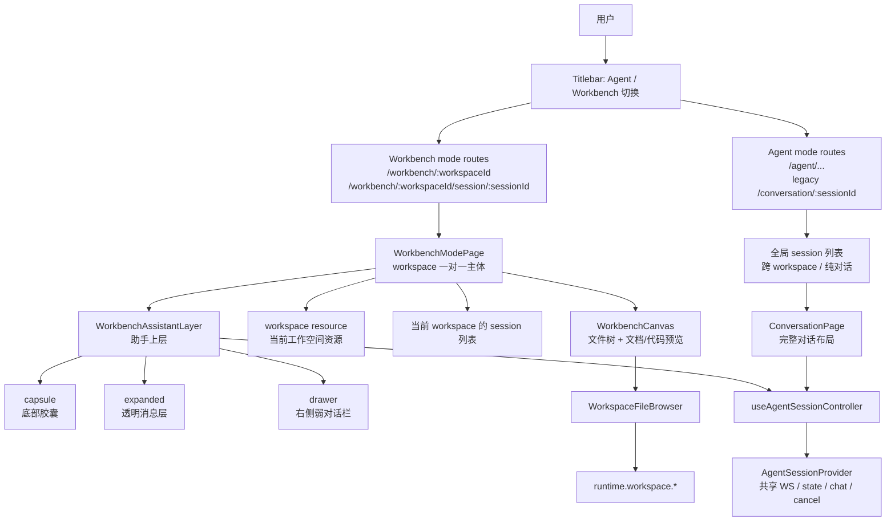
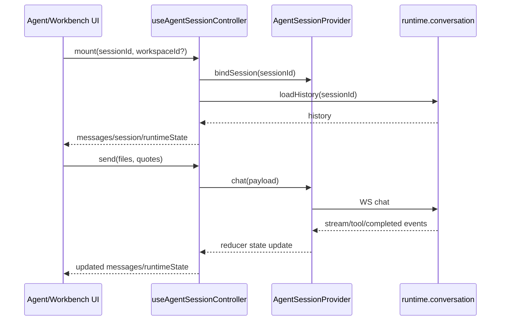
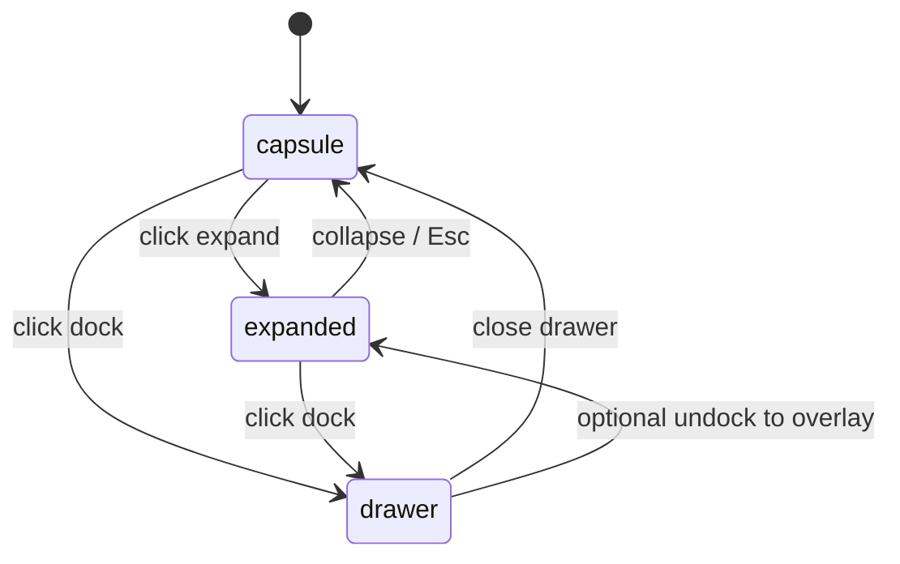

# DES-20260625-002-workbench-mode

| 字段 | 值 |
|------|-----|
| 文档编号 | DES-20260625-002-workbench-mode |
| 关联需求 | 本轮对话需求要点：Keydex 页面架构升级为 Agent / Workbench 双模式 |
| 创建日期 | 2026-06-25 |
| 负责人 | 待定 |
| 状态 | 草稿 |
| 最后更新 | 2026-06-25 |
| 需求类型 | 混合型（前端页面架构接入 + 助手呈现状态机制） |

---

## 一、概述与阅读导航

### 1.1 设计目标

当前 Keydex 桌面端以 Agent 对话页为主体：中央是完整对话流，文件系统、代码预览等能力通过侧边栏展开。该形态适合通用 Agent 桌面端，但在企业级开发任务中，用户高频工作对象是需求文档、设计文档、计划、Issue、代码、Diff、审阅意见等工作物。用户期望工作物成为主界面，Agent 变为常驻但低存在感的协作层。

本设计引入两个顶层模式。这里必须明确区分两个概念：

- **Workbench / 工作台模式**：新引入的应用顶层模式，决定整个应用页面布局、左侧列表数据来源、主内容加载逻辑和助手呈现方式。
- **workspace / 工作空间资源**：现有能力中的实际项目工作空间资源，session 创建时可挂载到某个 workspace，`runtime.workspace.*` 也继续表示这类资源。

- **Agent 模式**：保留现有对话为主体的页面布局，仅在标题栏加入模式切换入口。
- **Workbench 模式**：一个工作空间资源成为整个页面的一对一逻辑主体，默认直接进入真实项目文件 / 文档 / 代码工作台；该 workspace 下的 session 作为附属历史存在，Agent 以底部胶囊、透明消息层、右侧弱对话栏三种密度陪伴用户。

### 1.2 范围边界

#### 本次设计覆盖

- 顶部标题栏增加 `Agent / Workbench` 模式切换。
- Workbench 模式有当前 workspace 时直接进入真实工作区；没有当前 workspace 时进入轻量 workspace 选择页，让用户先选择工作空间资源。
- Workbench 模式下工作区主界面复用现有文件树、代码预览和引用能力。
- Workbench 模式下新增三种助手呈现状态：
  - `capsule`：底部常驻胶囊，默认状态。
  - `expanded`：胶囊向上展开为透明消息层。
  - `drawer`：右侧弱对话栏，适合持续交互。
- 抽取会话控制逻辑，避免 `ConversationPage` 与 Workbench 助手层复制运行时逻辑。
- 将本轮生成的 6 张概念图纳入前端开发参考；图片不作为验收条件。

#### 本次明确不做

- 不修改后端 Agent 协议、会话创建接口、WebSocket 协议。
- 不新增数据库表或迁移。
- 不把 Workbench 模式做成营销式欢迎页、启动页或 dashboard；仅允许在没有当前 workspace 时显示轻量 workspace 选择页。
- 不把透明消息层做成 modal、浮动卡片、抽屉或完整聊天页。
- 不把右侧弱对话栏复用为现有 `RightSidebarPanel` 文件预览窗口；两者职责不同。
- 不把图片作为验收条件；图片中的随机中文、代码内容、图标细节和背景信息均不得作为验收标准。

### 1.3 设计原则

- **工作物优先**：Workbench 模式下文档 / 文件 / 代码是主体，Agent 只是上层协作能力。
- **Agent 模式不回归**：现有对话页不因 Workbench 模式而重构视觉或交互。
- **模式优先于 session**：模式是应用顶层概念，session 只是模式下的数据对象；Workbench 页面由 `workspaceId` 定位，而不是由 `sessionId` 定位。
- **同一 workspace session，可跨模式出现**：Agent 模式能看到所有 session；Workbench 模式只显示当前 workspace 下的 session。Agent 模式中属于 workspace A 的 session，在 Workbench 模式打开 workspace A 时也应出现在该 workspace 的 session 列表中。
- **复用现有稳定底座**：复用 `AgentSessionProvider`、`WorkspaceFileBrowser`、`SendBox`、消息渲染与文件引用能力。
- **状态职责清晰**：顶层模式由路由 / Layout 上下文表达；Workbench 内的助手显示密度由 Workbench 页面状态表达。
- **最小侵入**：优先新增 Workbench 页面与共享 controller，不把当前 `ConversationPage` 改成多模式巨型组件。

### 1.4 阅读建议

先阅读第二章建立整体心智模型；再阅读第四章的功能点详细设计；最后查看第六章的图片开发参考。

---

## 二、需求整体总览视图

### 2.1 总体架构图



说明：

- `AgentSessionProvider` 已在全局 Provider 中存在，负责共享 WebSocket channel、session bind、chat、cancel、运行时状态。
- 新设计不复制 WebSocket 或消息 reducer，而是抽取 `useAgentSessionController(sessionId)`，由 Agent 模式和 Workbench 模式共同使用。
- Workbench 模式新增 `WorkbenchModePage`，页面由 `workspaceId` 定位，工作区主体优先复用 `WorkspaceFileBrowser`，助手层作为同页上层组件存在。
- session 的展示范围由模式决定：Agent 模式显示全局 session；Workbench 模式只显示当前 `workspaceId` 下的 session，且新建 session 默认归属该 workspace，不能创建非 workspace 纯对话。

### 2.2 功能点总表

| 功能点 | 目标 | 关键参与模块 | 关键数据/状态 | 是否需要详细时序 |
|--------|------|--------------|----------------|------------------|
| 顶部模式切换 | 在 Agent / Workbench 间切换，Agent 模式保留现状 | `Titlebar`, `Layout`, `Router` | `appMode`, `workspaceId`, `sessionId`, route target | 否 |
| Workbench 初始选择页 | 没有当前 workspace 时先让用户选择 workspace 资源 | `WorkbenchModePage`, `WorkspaceSelector`, `Router` | `workspaceId`, workspace list, route target | 否 |
| Workbench 直入工作区 | 有当前 workspace 时直接展示该 workspace 内容 | `WorkbenchModePage`, `WorkspaceFileBrowser` | `workspaceId`, `selectedSessionId`, `session.workspaceId` | 否 |
| Workbench workspace 切换器 | 在 Workbench 内切换当前 workspace 资源 | `WorkspaceSelector`, `WorkbenchModePage`, `Router` | `workspaceId`, workspace list, route target | 否 |
| 会话控制逻辑抽取 | 多种 UI 投影共用同一会话运行时 | `useAgentSessionController`, `ConversationPage`, `AgentSessionProvider` | `draft`, `messages`, `runtimeState`, `pendingApproval` | 是 |
| 底部助手胶囊 | 默认低存在感 Agent 入口 | `WorkbenchAssistantCapsule`, `SendBox` | `assistantSurface=capsule`, draft, model | 否 |
| 透明消息层 | 胶囊点击后消息向上展开，不改变工作区布局 | `WorkbenchAssistantExpandedLayer`, message components | `assistantSurface=expanded`, messages | 是 |
| 右侧弱对话栏 | 持续交互时提供次级聊天区域 | `WorkbenchAssistantDrawer`, message components, composer | `assistantSurface=drawer`, drawer width | 是 |
| 共享输入框契约 | Agent / Workbench 复用输入能力，差异由外壳注入 | `SendBox`, `AgentComposer`, `WorkbenchAssistantCapsule`, `WorkbenchAssistantDrawerComposer` | variant, slots, context items, surface actions | 否 |
| 图片开发参考 | 将概念图作为前端实现时的布局与交互参考 | DES assets | 6 张参考图 + 文字设计规则 | 否 |

### 2.3 核心链路串联说明

1. 用户在标题栏 logo 旁看到 `Agent / Workbench` 切换。
2. `Agent` 选中时进入 Agent 模式页面，保留当前完整对话布局；左侧 session 列表是全局列表，包含纯对话 session 与多个 workspace 下的 session。
3. `Workbench` 选中且能解析当前 workspace 时进入 `/workbench/:workspaceId` 或 `/workbench/:workspaceId/session/:sessionId`，主区域直接展示该 workspace 的文件树和代码 / 文档预览。
4. `Workbench` 选中但没有可用当前 workspace 时进入 `/workbench`，显示轻量 workspace 选择页；选择 workspace 后再进入 `/workbench/:workspaceId`。
5. Workbench 左侧顶部提供当前 workspace 切换器，复用新会话页的 `WorkspaceSelector`，但去掉 `无项目聊天` / 纯会话选项。
5. Workbench 左侧 session 列表只显示当前 workspace 下的 session；从 Workbench 发起的新 session 自动归属当前 workspace，session 新建流程本身不再提供 workspace 归属选择或纯对话入口。
6. Workbench 默认显示底部助手胶囊，用户可直接输入、选择模型、引用文件或选区。
7. 用户需要临时翻看消息时，点击胶囊展开按钮，消息从胶囊向上展开为透明上层消息列；没有大背景面板，工作区不被挤压。
8. 用户需要持续对话时，点击 dock 按钮，底部胶囊消失，右侧出现窄助手栏；工作区仍是主体。
9. 三种 Workbench 助手状态共用同一个会话 controller，不中断运行中任务、不重复绑定 WebSocket。

### 2.4 关键设计结论

| 设计主题 | 结论 | 原因 |
|----------|------|------|
| 顶层模式 | `Agent` 与 `Workbench` 是顶层模式 | 模式决定页面布局、数据加载逻辑和 session 列表范围 |
| workspace 资源 | workspace 不是模式名，而是 Workbench 页面的一对一业务主体 | 避免和现有 session 挂载工作空间的能力混淆 |
| workspace 切换 | Workbench 内通过复用 `WorkspaceSelector` 切换当前 workspace，隐藏纯会话选项 | 避免新增一套选择器，同时保证 Workbench 没有纯对话语义 |
| Workbench 初始页 | 有 workspace 时直入工作区；无 workspace 时显示轻量 workspace 选择页 | 既保证工作区主体心智，也避免首次进入时用户无处选择 |
| 助手呈现状态 | `capsule` / `expanded` / `drawer` 是 Workbench 内状态 | 它们是助手密度，不是顶层产品模式 |
| 透明消息层 | 只显示消息气泡和局部 blur，不显示面板容器 | 符合“胶囊向上展开，不侵入工作区”语义 |
| 右侧弱对话栏 | 不复用现有 `RightSidebarPanel` | 现有右侧栏承载文件 / 预览窗口管理，和对话栏职责不同 |
| session 范围 | Agent 全局展示，Workbench 按当前 workspace 过滤 | 两种模式都有 session 和 workspace，但逻辑优先级相反 |
| 会话运行时 | 抽取共享 controller，复用 `AgentSessionProvider` | 保证运行时逻辑复用且运行不中断 |

---

## 三、项目现状分析与设计约束

### 3.1 技术栈概览

| 层级 | 当前技术 | 版本 / 来源 |
|------|----------|-------------|
| 桌面壳 | Tauri | `@tauri-apps/api` 2.0.0 |
| 前端构建 | Vite + TypeScript | `vite` 6.0.11, `typescript` 5.7.3 |
| 前端框架 | React | 19.1.0 |
| 路由 | React Router | 7.8.0 |
| 状态 / 渲染 | React Context + reducer + zustand | 项目现状 |
| UI 图标 | lucide-react | 0.468.0 |
| 代码 / 文档预览 | CodeMirror, react-markdown, syntax highlighter, mermaid | `desktop/package.json` |
| 测试 | Vitest, Testing Library, Playwright | `desktop/package.json` |

### 3.2 项目结构

```text
desktop/src/
├── App.tsx
├── runtime/                         # runtime bridge 与工作区/会话 API
└── renderer/
    ├── components/
    │   ├── layout/                  # Layout, Router, Titlebar, Sider, RightSidebar
    │   ├── workspace/               # WorkspaceFileBrowser, WorkspacePanel, FilePreview
    │   └── chat/SendBox             # 输入框、@ 文件、/ 命令
    ├── hooks/layout/                # LayoutStateProvider, layoutStore
    ├── pages/
    │   ├── conversation/            # ConversationPage, ChatLayout, MessageList
    │   └── home/                    # HomePage, workspace/session 创建入口
    ├── providers/                   # AppProviders, AgentSessionProvider, PreviewProvider
    └── stores/                      # agentSessionStore, conversationStore
```

### 3.3 相关现有模块

| 模块名 | 位置 | 与本次设计的关系 |
|--------|------|------------------|
| `AppProviders` | `desktop/src/renderer/providers/AppProviders.tsx` | 已全局包裹 `AgentSessionProvider`、`PreviewProvider`、`LayoutStateProvider`，可支撑跨页面共享会话与预览 |
| `Router` | `desktop/src/renderer/components/layout/Router.tsx` | 当前有 `/conversation/:threadId`；需新增模式化路由，Agent 作为现有页面的模式归属，Workbench 以 `/workbench/:workspaceId` 为主键 |
| `Layout` | `desktop/src/renderer/components/layout/Layout.tsx` | 提供全局 shell、左侧导航、右侧文件/预览栏；需向 `Titlebar` 传入模式切换 props |
| `Titlebar` | `desktop/src/renderer/components/layout/Titlebar/Titlebar.tsx` | 当前 logo 旁是占位导航，可替换为模式切换控件 |
| `layoutStore` | `desktop/src/renderer/hooks/layout/layoutStore.ts` | 当前保存侧栏、右栏、面板宽度；需新增 Workbench 助手展示偏好和最近 workbench workspace 记忆 |
| `AgentSessionProvider` | `desktop/src/renderer/providers/AgentSessionProvider.tsx` | 已提供共享 `state/dispatch/wsStatus/chat/cancel/bindSession`，是多投影会话运行时基础 |
| `ConversationPage` | `desktop/src/renderer/pages/conversation/ConversationPage.tsx` | 当前混合了会话控制与完整对话布局；需抽取 controller 后继续作为 Agent 模式 |
| `ChatLayout` | `desktop/src/renderer/pages/conversation/ChatLayout/ChatLayout.tsx` | Agent 模式完整聊天布局保留；部分消息/输入能力可被 Workbench Drawer 复用 |
| `MessageList` | `desktop/src/renderer/pages/conversation/messages/MessageList.tsx` | 可作为消息渲染来源；Workbench 透明层建议用轻量投影或新增 compact 模式 |
| `SendBox` | `desktop/src/renderer/components/chat/SendBox/SendBox.tsx` | 已支持 `variant="keydex"`、文件引用、外部 file/quote chip；可扩展为胶囊形态 |
| `WorkspaceFileBrowser` | `desktop/src/renderer/components/workspace/WorkspaceFileBrowser.tsx` | 当前作为侧边栏文件浏览器，可提升为 Workbench 主体中的 workspace 浏览器 |
| `WorkspaceSelector` | `desktop/src/renderer/components/workspace/WorkspaceSelector.tsx` | 当前新会话页用于选择 workspace / 无项目聊天；Workbench 可复用该选择器，但必须隐藏纯会话选项 |

### 3.4 现有可复用能力

- `AgentSessionProvider` 统一打开 WebSocket channel，支持 `bindSession`、`chat`、`cancel`、`requestStatus`。
- `ConversationPage` 已优先使用共享 `AgentSessionProvider`，具备抽取 controller 的基础。
- `WorkspaceFileBrowser` 已支持 `workspaceId` / `sessionId`、文件树、预览路径、Markdown outline、选区引用、批注发起对话。
- `WorkspaceSelector` 已支持 workspace 搜索、选择、添加项目、手动路径输入和 `chat` 选项；Workbench 只复用 workspace 选择能力，不暴露 `chat` 选项。
- `SendBox` 已支持文件上下文、选区上下文、`@` 文件搜索、`/` 命令、停止/发送按钮。
- `Layout` 已支持全局 shell、左侧导航、右侧栏 resize 和右侧栏 placement。

### 3.5 设计约束

- `.ktaicoding/CONSTITUTION.md` 当前不存在，本 DES 暂按现有代码结构、本轮对话需求与已有项目约定作为临时约束。后续如补充项目宪法，应回看本 DES 是否需要调整。
- 右侧文件 / 预览栏已有复杂状态，不应直接塞入 Workbench 助手 Drawer，避免两个功能共用一个右栏状态机。
- 之前工作区文件树与预览 resize 存在性能敏感点，Workbench 透明消息层不得通过挤压主工作区布局触发大面积重排。
- 对话胶囊和展开消息层是两个不同视觉语义，不应把展开态做成完整聊天页缩小版。

---

## 四、功能点详细设计

### 4.1 顶部 Agent / Workbench 模式切换

#### 4.1.1 功能目标与边界

在标题栏 logo 旁增加紧凑分段控件，允许用户在 Agent 模式与 Workbench 模式之间手动切换。模式是应用顶层概念，决定整个页面的布局和数据加载方式，不由 session 自动推断。

#### 4.1.2 触发方式 / 入口

- 入口：`Titlebar` 左侧 `brandMark` 之后。
- 选项：`Agent`、`Workbench`。
- 当前选中态：
  - Agent canonical route：`/agent/...`；兼容期可将现有 `/conversation/:sessionId` 视为 Agent 模式入口或重定向到 Agent route。
  - Workbench canonical route：`/workbench`、`/workbench/:workspaceId` 或 `/workbench/:workspaceId/session/:sessionId`。
- 点击另一个选项后执行手动路由跳转，不做自动模式切换。
- Agent -> Workbench 的目标 workspace 选择规则：
  - 如果当前 Agent session 绑定了 `workspaceId`，进入对应 `/workbench/:workspaceId`。
  - 如果当前 Agent session 是纯对话 session，则进入最近一次 Workbench workspace；若没有最近记录，则进入 `/workbench`，提示用户先选择 workspace 资源。
- Workbench -> Agent 的目标 session 选择规则：
  - 若当前 Workbench 已选中 session，进入该 session 的 Agent 完整对话页。
  - 若未选中 session，进入 Agent 模式默认会话列表 / 当前全局选择，不自动创建 session。

#### 4.1.3 核心逻辑

推荐把模式作为路由语义而非纯 local state：

```ts
type AppMode = "agent" | "workbench";

interface LayoutProps {
  appMode?: AppMode;
  modeSwitch?: {
    agentPath?: string;
    workbenchPath?: string;
    disabledWorkbench?: boolean;
  };
}
```

- `AgentRoute` 渲染 `RoutedLayout appMode="agent"`。
- 新增 `WorkbenchRoute` 渲染 `RoutedLayout appMode="workbench"`。
- `Titlebar` 只负责展示和触发 `onModeChange`，不直接理解 session 细节。
- mode switch target 由路由层或上层 shell 根据当前模式、当前 session、最近 workspace 记忆计算。

#### 4.1.4 与现有项目关联

- 修改：`Router.tsx` 新增模式化路由，至少支持 `/workbench/:workspaceId` 与 `/workbench/:workspaceId/session/:sessionId`。
- 兼容：现有 `/conversation/:threadId` 可短期保留为 Agent 模式 legacy route，但新内部地址应逐步带上 `agent` 模式前缀。
- 修改：`RoutedLayout` 向 `Layout` 传入 `appMode` 和 mode switch 目标 path。
- 修改：`Layout.tsx` 向 `Titlebar` 透传 mode switch props。
- 修改：`Titlebar.tsx` 替换 `navGhost` 为真实分段控件。

#### 4.1.5 边界与失败处理

- 纯对话 session 点击 Workbench：
  - 不根据该 session 生成 Workbench 页面；只能进入最近 workbench workspace 或提示用户选择 workspace 资源。
- URL 中 `sessionId` 不属于当前 `workspaceId`：
  - 保留 workbench 页面主体，但清空 / 忽略该 session 选择，并给出轻量提示；不得切换到其他 workspace。
- 用户在 Workbench 中打开设置页再返回：
  - 路由 state 保留 `from`，返回原模式。
- Agent 模式必须保留现有聊天布局，不能因新增切换控件改变对话页布局。

---

### 4.2 Workbench 选择 workspace 与直入工作区

#### 4.2.1 功能目标与边界

Workbench 模式的页面主体就是某一个 workspace 资源：文件树 / 文档树 + 代码 / 文档预览。Workbench 页面和 workspace 是一对一关系，不能以 session 作为页面主键。

但 Workbench 也需要处理“尚无当前 workspace”的初始状态：用户首次进入、最近 workspace 失效、或从纯对话 session 手动切到 Workbench 且没有历史 workspace 记忆时，允许进入 `/workbench` 轻量选择页。该页面只负责选择 workspace 资源，不是营销式欢迎页、启动页或 dashboard；选择完成后必须跳转到 `/workbench/:workspaceId`。

#### 4.2.2 触发方式 / 入口

- 用户在 Agent 模式手动点击 `Workbench`。
- 用户在 Workbench 模式下选择某个 workspace 资源。
- 用户直接访问 `/workbench`、`/workbench/:workspaceId` 或 `/workbench/:workspaceId/session/:sessionId`。

#### 4.2.3 核心逻辑

新增 `WorkbenchModePage`。当 `workspaceId` 为空时先渲染轻量 workspace 选择页：

```tsx
function WorkbenchModePage({ workspaceId, selectedSessionId, runtime, initialModel }) {
  if (!workspaceId) {
    return (
      <WorkbenchInitialWorkspacePicker
        runtime={runtime}
        allowProjectFreeChat={false}
        onSelectWorkspace={(nextWorkspaceId) => navigate(workbenchPath(nextWorkspaceId))}
      />
    );
  }

  // 有 workspaceId 后进入真实工作台主体。
}
```

当 `workspaceId` 存在时渲染工作台主体：

```tsx
function WorkbenchModePage({ workspaceId, selectedSessionId, runtime, initialModel }) {
  const sessions = useWorkspaceSessions({ workspaceId, runtime });
  const controller = useAgentSessionController({
    sessionId: selectedSessionId,
    workspaceId,
    runtime,
    initialModel,
  });

  return (
    <WorkbenchModeShell>
      <WorkbenchSessionList
        workspaceId={workspaceId}
        sessions={sessions}
        selectedSessionId={selectedSessionId}
      />
      <WorkbenchCanvas
        workspaceId={workspaceId}
        runtime={runtime}
        onQuoteSelection={controller.quoteSelection}
        onStartChatFromAnnotation={controller.startChatFromAnnotation}
      />
      <WorkbenchAssistantLayer controller={controller} workspaceId={workspaceId} />
    </WorkbenchModeShell>
  );
}
```

`WorkbenchCanvas` 第一版直接复用 `WorkspaceFileBrowser`。如果 `WorkspaceFileBrowser` 当前仍依赖 `sessionId` 查询工作区，需要在执行阶段做适配，优先改为以 `workspaceId` 驱动；对于需要 session 上下文的引用 / 批注能力，再传入 `selectedSessionId`：

```tsx
<WorkspaceFileBrowser
  workspaceId={workspaceId}
  sessionId={selectedSessionId}
  label={workspaceLabel}
  runtime={runtime}
  onQuoteSelection={quoteSelection}
  onStartChatFromAnnotation={startChatFromAnnotation}
/>
```

#### 4.2.4 视觉规则

- 页面主体从左到右：
  - 全局左侧导航保留。
  - Workbench 左侧顶部显示当前 workspace selector。
  - 主内容区为 full-height 工作区。
  - 工作区内部有文件树 / 文档树和代码 / 文档预览。
- 没有当前 workspace 时，主内容区显示轻量 workspace 选择页：
  - 居中或略靠上显示 `WorkspaceSelector` 能力的选择入口。
  - 可显示 workspace 搜索、最近 workspace 列表和“添加本地项目”入口。
  - 不显示 `无项目聊天` / 纯会话选项。
  - 底部助手胶囊可以保留为禁用 / 安静状态，提示先选择 workspace，不允许发起纯对话。
- Workbench 模式左侧 session 列表只显示当前 workspace 下的 session。
- Workbench 模式下新建 session 自动归属当前 workspace；如需切换 workspace，用户先通过 workspace selector 改变当前工作台资源，新建流程本身不提供 workspace 归属选择或纯对话入口。
- 不显示中央完整聊天消息列。
- 无选中文件时，只允许显示轻量空预览或最近文件；不能显示欢迎大卡片。
- 底部胶囊悬浮在工作区上层，不改变工作区布局。

#### 4.2.5 与现有项目关联

- 复用：`WorkspaceFileBrowser`、`WorkspacePanel`、`FilePreview`、`PreviewProvider`。
- 新增：`pages/workbench/WorkbenchModePage.tsx`、`WorkbenchModePage.module.css`。
- 修改：`Router.tsx` 增加 lazy route。

#### 4.2.6 边界与失败处理

- workspace 未加载完成：工作区主体可显示轻量 skeleton，但不得显示启动页。
- 当前 workspace 下无 session：工作区主体仍展示文件 / 文档；助手胶囊处于可新建当前 workspace session 的状态。
- URL 中 session 不属于当前 workspace：忽略该 session 选择并提示，不能把 Workbench 页面跳到 session 所属的其他 workspace。
- workspace 路径失效：显示轻量错误态，并提供返回 `/workbench` 重新选择 workspace 的入口；不得自动切到其他 workspace。

#### 4.2.7 Workbench workspace 切换器

Workbench 模式必须提供当前 workspace 的切换入口。该入口复用新会话页已有的 `WorkspaceSelector`，避免重新发明 workspace 列表、搜索、添加项目、手动输入路径等能力。

复用方式：

```tsx
<WorkspaceSelector
  value={{ type: "workspace", workspace: currentWorkspace }}
  workspaces={workspaces}
  allowProjectFreeChat={false}
  onSelectWorkspace={(workspace) => navigate(workbenchPath(workspace.id))}
  onAddWorkspace={addWorkspace}
  onPickWorkspacePath={pickWorkspacePath}
/>
```

`allowProjectFreeChat={false}` 为建议新增 prop，含义是：

- 不渲染 `无项目聊天` / `chat` option。
- 不显示 MessageCircle 的纯会话语义。
- `value` 不接受 `{ type: "chat" }` 作为 Workbench 正常态。
- Workbench 无 workspace 时显示“选择工作区”或轻量错误 / 空状态，但不进入纯对话。

切换规则：

- 选择 workspace B 后，路由进入 `/workbench/:workspaceB`。
- 主体文件树、预览、`@` 搜索 scope 全部切到 workspace B。
- 左侧 session 列表切到 workspace B 的 session。
- workspace A 的 selected session 不带到 workspace B。
- workspace B 若有最近 session，可按后续策略选中最近 session；若无 session，仍展示 workspace B 文件树，胶囊可创建 workspace B session。

边界：

- workspace selector 是 Workbench 内部资源切换器，不是顶部 `Agent / Workbench` 模式切换的一部分。
- workspace selector 不是启动页；选择器展开时是轻量 popover，不替换主工作台页面。
- 新建 session 时不再二次选择 workspace；当前 workspace 已由 selector 决定。

---

### 4.3 会话控制逻辑抽取

#### 4.3.1 功能目标与边界

将 `ConversationPage` 中与会话运行相关的逻辑抽取为共享 hook，使 Agent 完整对话页和 Workbench 助手层共用同一套能力。

#### 4.3.2 核心逻辑

新增：

```ts
interface AgentSessionController {
  session: AgentSession | null;
  messages: ConversationMessage[];
  draft: string;
  runtimeState: ConversationRuntimeState;
  runtimeDetail: string | null;
  pendingApproval: CommandApprovalRequest | null;
  canSend: boolean;
  canStop: boolean;
  workspaceId?: string;
  workspaceLabel?: string;
  searchWorkspace?: WorkspaceFileSearchFn;
  listWorkspaceDirectory?: (path: string) => Promise<WorkspaceSearchResult[]>;
  fileChipRequest: SendBoxExternalFileRequest | null;
  quoteChipRequest: SendBoxExternalQuoteRequest | null;
  setDraft(value: string): void;
  send(files?: SelectedFile[], quotes?: SelectedQuote[]): boolean;
  stop(): void;
  submitApproval(decision: CommandApprovalDecisionPayload): Promise<void>;
  loadOlderHistory(): Promise<void>;
  quoteSelection(request: string | PreviewQuoteSelectionRequest): void;
  startChatFromAnnotation(request: PreviewAnnotationChatRequest): void;
}
```

抽取内容来自 `ConversationPage` 当前逻辑：

- session 选择与历史加载。
- `agentMessages` 到 `ConversationMessage` 的转换。
- `sendText` / `send` / `stop`。
- pending approval 提交。
- workspace search/list directory。
- file chip / quote chip 外部注入。
- preview host context。

#### 4.3.3 时序图



#### 4.3.4 与现有项目关联

- 修改：`ConversationPage` 改为使用 controller，但保留 `ChatLayout` 结构。
- 新增：`pages/conversation/useAgentSessionController.ts` 或 `renderer/hooks/useAgentSessionController.ts`。
- 保持：`AgentSessionProvider` 作为运行时来源，不新增平行 WebSocket。

#### 4.3.5 边界与失败处理

- controller 必须支持现有 `quickSendId` 逻辑。
- controller 必须支持没有共享 runtime context 时的本地 fallback，或明确迁移为强依赖全局 provider。
- 运行中手动切换 Agent / Workbench 不应取消任务、不应丢失流式消息。

---

### 4.4 Workbench 底部助手胶囊

#### 4.4.1 功能目标与边界

默认状态下，Workbench 模式不显示完整聊天区域，只显示底部常驻胶囊，作为和 Agent 沟通的入口。胶囊本身低存在感，不遮挡主要工作内容。

Workbench 不应重新实现一套输入框。Agent 模式与 Workbench 模式必须复用同一套输入能力，差异只体现在外层容器、视觉 variant 和 surface actions。

#### 4.4.2 触发方式 / 入口

- 进入 Workbench 模式默认 `assistantSurface = "capsule"`。
- 从透明展开态点击 collapse 回到胶囊。
- 从右侧 drawer 点击 close 回到胶囊。

#### 4.4.3 核心逻辑

输入框按三层拆分：

```text
useAgentSessionController
  -> 负责 draft / send / stop / approval / contextItems / runtime state

SendBox
  -> 负责输入、文件 chip、quote chip、@ 文件搜索、/ 命令、键盘交互、发送/停止基础能力

AgentComposer / WorkbenchAssistantCapsule / WorkbenchAssistantDrawerComposer
  -> 负责放置位置、视觉密度、surface actions
```

`SendBox` 不应直接理解“进入透明层”或“dock 到右侧”的业务含义；这些差异化操作由 wrapper 通过 slot / accessory 注入。

```ts
type WorkbenchAssistantSurface = "capsule" | "expanded" | "drawer";

interface WorkbenchAssistantState {
  surface: WorkbenchAssistantSurface;
  drawerWidth: number; // default 400, clamp 360-520
}

type SendBoxVariant = "keydex" | "workbench-capsule" | "workbench-drawer";

interface SendBoxSurfaceSlots {
  leftAccessory?: React.ReactNode;
  rightAccessory?: React.ReactNode;
  surfaceActions?: React.ReactNode;
}
```

`WorkbenchAssistantCapsule` 使用 controller 的发送能力：

```tsx
<SendBox
  variant="workbench-capsule"
  value={controller.draft}
  runtimeState={controller.runtimeState}
  canSend={controller.canSend}
  canStop={controller.canStop}
  placeholder="和 Keydex 说点什么..."
  surfaceActions={<CapsuleSurfaceActions />}
  rightControls={<RuntimeModelSelector compact />}
  onChange={controller.setDraft}
  onSend={controller.send}
  onStop={controller.stop}
/>
```

#### 4.4.4 视觉规则

- 胶囊水平居中或靠近底部工作区中心。
- 胶囊高度低于现有完整 composer，不显示多余说明文字。
- 包含：
  - assistant/status icon。
  - 输入 placeholder。
  - 模型 chip。
  - 展开消息按钮。
  - dock 到右侧按钮。
  - 发送 / 停止按钮。
- 正在运行时，胶囊可显示简短状态，但不能扩展成完整消息面板。

#### 4.4.5 与现有项目关联

- 复用：`SendBox` 的上下文 chip、文件引用、选区引用、`@` 文件搜索、`/` 命令、发送、停止、快捷输入。
- 修改：`SendBoxProps.variant` 增加 `"workbench-capsule"` 和必要的 `"workbench-drawer"`，并提供 slot / accessory 注入 surface actions。
- 新增：`WorkbenchAssistantCapsule.tsx`。
- 新增或调整：Agent 模式保留现有 composer wrapper；Workbench 只新增 wrapper，不复制输入核心逻辑。

#### 4.4.6 边界与失败处理

- pending approval 出现时，胶囊需要显示审批入口或自动升级到 drawer，避免审批被隐藏。
- `@` 文件搜索菜单需要继续按容器宽度 clamp，不得溢出工作区。
- 胶囊展开 / dock 不应清空 draft。
- Workbench 的展开 / dock 按钮不能出现在 Agent 模式输入框里。
- 新增输入能力时，不应要求分别修改 Agent 输入框和 Workbench 输入框两套逻辑。

---

### 4.5 胶囊向上展开透明消息层

#### 4.5.1 功能目标与边界

用户点击胶囊展开按钮后，消息从底部胶囊向上展开。该状态只存在于 Workbench 模式。它不是面板、不是 modal、不是右侧栏、不是完整聊天页。

#### 4.5.2 触发方式 / 入口

- 从 `capsule` 点击展开按钮：`surface = "expanded"`。
- 按 `Esc`、点击 collapse 按钮或发送后按策略回到 `capsule`。
- 点击 dock 按钮可从 `expanded` 切到 `drawer`。

#### 4.5.3 关键状态流转



#### 4.5.4 视觉规则

必须满足：

- 没有大卡片容器。
- 没有 opaque overlay panel。
- 没有暗色 backdrop。
- 没有改变工作区布局或挤压文件树 / 代码预览。
- 可见实体只有：
  - 单条用户 / assistant 消息气泡。
  - 底部胶囊输入区。
  - 少量 collapse / dock / send 操作按钮。
- 消息列背后可有局部 `backdrop-filter: blur(...)` 和极淡遮罩，范围只包住消息列附近。
- 工作区内容在消息之间、消息列之外仍可见。

建议 DOM：

```tsx
<div className={styles.assistantExpandedLayer} data-surface="expanded">
  <div className={styles.messageReadabilityVeil} />
  <div className={styles.messageColumn}>
    <WorkbenchMessageBubble />
    <WorkbenchMessageBubble />
  </div>
  <WorkbenchAssistantCapsule expanded />
</div>
```

建议 CSS 语义：

```css
.assistantExpandedLayer {
  position: absolute;
  inset: auto 0 20px 0;
  z-index: 40;
  pointer-events: none;
}

.messageReadabilityVeil {
  position: absolute;
  left: 50%;
  bottom: 68px;
  width: min(720px, calc(100% - 96px));
  height: min(62vh, 560px);
  transform: translateX(-50%);
  backdrop-filter: blur(8px);
  background: rgb(255 255 255 / 0.18);
  mask-image: linear-gradient(180deg, transparent, #000 14%, #000 86%, transparent);
  pointer-events: none;
}

.messageColumn,
.capsule {
  pointer-events: auto;
}
```

#### 4.5.5 与现有项目关联

- 可复用 `MessageList` 中的消息渲染子组件，但不建议直接嵌入完整 `ChatLayout`。
- 建议新增 compact message projection，避免完整消息列表的滚动容器、空状态、顶部栏进入透明层。
- 需要处理 text selection / copy / file preview 行为，保持可用。

#### 4.5.6 边界与失败处理

- 消息过多：只显示最近 N 条，顶部渐隐；提供“打开 Agent 模式”或“dock 到右侧”查看完整历史。
- 工作区底层太花：局部 blur + 气泡底色提高可读性，但不得升级成完整面板背景。
- 用户点击气泡外区域：默认不关闭，避免误触；`Esc` 或 collapse 明确关闭。

---

### 4.6 Workbench 右侧弱对话栏

#### 4.6.1 功能目标与边界

为持续高强度交互提供右侧弱对话栏。它比 Agent 模式弱，不能抢走工作区主体。

#### 4.6.2 触发方式 / 入口

- 从底部胶囊点击 dock 按钮。
- 从透明展开态点击 dock 按钮。
- 关闭 drawer 回到 `capsule`。

#### 4.6.3 核心逻辑

`WorkbenchModePage` 内部布局在 drawer 状态下变为：

```tsx
<div className={styles.workbenchMode} data-assistant-surface="drawer">
  <WorkbenchCanvas />
  <WorkbenchAssistantDrawer controller={controller} />
</div>
```

视觉宽度：

- 默认 400px。
- 最小 360px。
- 最大 520px。
- 小窗口下可占据右侧固定比例，但仍需保留工作区可读区域。

#### 4.6.4 视觉规则

- 底部胶囊消失。
- 右侧栏包含：
  - 紧凑标题 `Keydex 助手`。
  - 小状态行。
  - 最近消息列表。
  - 底部 composer。
  - 关闭、切回透明层 / Agent 模式的必要操作。
- 右侧栏是次级区域，不能使用 Agent 模式中央完整聊天页的视觉重量。
- drawer 底部 composer 继续复用 `SendBox` 输入核心，只使用 `workbench-drawer` 视觉 variant 和 drawer 专属 wrapper。

#### 4.6.5 与现有项目关联

- 不复用 `RightSidebarPanel`，避免文件预览 tab 状态与对话状态冲突。
- 可复用 `SendBox`、`MessageList` 的部分子组件。
- `WorkbenchCanvas` 与 drawer 同处 Workbench 页面内部，便于控制宽度和层级。

#### 4.6.6 边界与失败处理

- 如果右侧文件预览栏也打开：Workbench 模式下建议以工作区内部 preview 为主，避免同时出现两个右侧区域。
- 如果窗口过窄：drawer 可改为覆盖式窄层，但仍不是透明展开态。
- 运行中关闭 drawer 不取消任务，回到胶囊显示运行状态。

---

## 五、横切设计汇总

### 5.1 接口设计汇总

本次设计优先复用现有 runtime bridge。若现有前端 runtime 无法按 `workspaceId` 列出 session，需要补一个前端 bridge/后端能力适配；该适配应作为单独开发 issue 拆出，不能混入 UI 组件实现。

| 能力 | 现有调用 | 说明 |
|------|----------|------|
| 会话历史 | `runtime.conversation.loadHistory(sessionId, ...)` | controller 复用 |
| 会话 WebSocket | `runtime.conversation.openChatChannel(...)` | 由 `AgentSessionProvider` 统一维护 |
| 发送消息 | `AgentSessionProvider.chat(payload)` | Agent / Workbench 共用 |
| 取消任务 | `AgentSessionProvider.cancel(sessionId)` | Agent / Workbench 共用 |
| 全局 session 列表 | 现有 conversation/session list 能力 | Agent 模式使用，显示所有 session |
| workspace session 列表 | `runtime.conversation.listByWorkspace(workspaceId)` 或等价过滤适配 | Workbench 模式使用，只显示当前 workspace 下的 session |
| 工作区搜索 | `runtime.workspace.search({ workspaceId, sessionId? }, query)` | `SendBox @` 与文件树共用 |
| 工作区目录 | `runtime.workspace.listDirectory({ workspaceId, sessionId? }, path)` | `WorkspaceFileBrowser` 复用 |
| 审批处理 | `runtime.settings.resolveApproval(...)` | controller 复用 |

### 5.2 数据库 / 模型设计汇总

不涉及数据库变更。

前端新增 / 调整类型建议：

```ts
export type AppMode = "agent" | "workbench";

export type WorkbenchAssistantSurface = "capsule" | "expanded" | "drawer";

export interface WorkbenchAssistantPreferences {
  surface?: WorkbenchAssistantSurface;
  drawerWidth?: number;
  lastWorkspaceId?: string;
}
```

`layoutStore` 持久化建议：

- 持久化 `workbenchAssistantDrawerWidth`。
- 可持久化最近一次 Workbench workspace，用于纯对话 session 手动切入 Workbench 时的目标 workspace。
- 是否持久化 `workbenchAssistantSurface` 需要谨慎：
  - 推荐只持久化 drawer width，不持久化 `expanded`。
  - 可持久化最近使用的 `drawer` 偏好，但进入新 Workbench workspace 默认为 `capsule`。

### 5.3 配置变更

不新增环境变量或配置文件。

### 5.4 多服务改动

| 服务 / 模块 | 改动类型 | 说明 |
|-------------|----------|------|
| desktop renderer | 修改 / 新增 | 页面架构与组件 |
| backend runtime | 不改 | 使用现有会话与工作区 API |
| Tauri main | 不改 | 不涉及窗口能力变化 |

### 5.5 安全 / 权限 / 审计

- 继续沿用现有命令审批与 `pendingApproval` 处理。
- Workbench 胶囊和 drawer 必须显式暴露审批状态，不能隐藏审批请求。
- 文件引用、选区引用继续使用现有 `prepareComposerMessage` 与 context items，不新增绕过路径。

---

## 六、图片开发参考

图片存放目录：

```text
.ktaicoding/des/assets/DES-20260625-002-workbench-mode/
├── 01-agent-mode-v2.png
├── 02-workbench-initial-select-workspace.png
├── 02-workbench-capsule-v2.png
├── 03-workbench-workspace-selector.png
├── 04-workbench-expanded-layer-v2.png
└── 05-workbench-drawer-v2.png
```

### 6.0 图片使用范围规则

这些图片只作为前端实现时理解布局方向、层级关系和交互形态的开发参考，不作为验收条件、E2E 断言依据、像素级 UI 规范或示例数据规范。验收应以本 DES 的文字规则、功能测试、组件测试和 E2E 页面可见结果为准。

统一忽略内容：

- 图片中模型生成导致的随机中文、英文、代码、文件名、路径、时间、数字、图标细节。
- 不在该图片开发参考焦点内的背景工作区、左侧列表、右侧预览、文件树层级、session 文案、示例项目名称。
- 精确像素、精确色值、阴影强度、圆角半径、具体 icon 形态；这些以现有设计系统和实现约束为准。
- 与本 DES 明确文字规则冲突的图片背景信息。若图片和文字规则冲突，以本 DES 的文字规则为准。

### 6.1 01 Agent 模式


开发参考焦点：

- Agent 模式保持现有完整对话页布局。
- 只新增标题栏 `Agent / Workbench` 模式切换入口。
- 不把中央聊天区替换成工作区。
- 不改变现有右侧文件 / 预览侧栏行为。

忽略内容：

- 图中具体会话内容、文件名、代码内容、右侧文件路径和左侧列表示例数据。
- 模式切换控件的精确尺寸、颜色和 icon 样式；实现以文字规则和现有设计系统为准。

### 6.2 02 Workbench 初始选择页与默认胶囊态

#### 6.2.1 无当前 workspace：轻量选择页


开发参考焦点：

- 只在 Workbench 模式没有当前 workspace 时出现。
- 页面是轻量 workspace 选择页，不是营销式欢迎页、启动页或 dashboard。
- 用户可以搜索 workspace、选择最近 workspace、添加本地项目。
- 不显示 `无项目聊天` / 纯会话选项。
- 底部助手胶囊可以存在，但必须是禁用 / 安静状态，提示先选择 workspace，不能发起纯对话。
- 选择 workspace 后跳转到 `/workbench/:workspaceId`，进入真实工作台。

忽略内容：

- 图中的具体 workspace 名称、路径、数量、排序和左侧历史 session 示例。
- 中央选择区的精确文案排版；实现只需保持轻量、非营销、可选择 workspace。
- 胶囊中具体 icon 与禁用态视觉细节；实现需保证不能发送纯对话。

#### 6.2.2 有当前 workspace：默认胶囊态


开发参考焦点：

- Workbench 模式已有当前 workspace 时直接进入该 workspace 的真实工作区。
- 不能出现工作区启动页、项目选择主页或营销式 dashboard。
- 左侧顶部有当前 workspace selector，可切换 workspace。
- workspace selector 不显示 `无项目聊天` / 纯会话选项。
- 主体是文件树 / 文档树 + 代码 / 文档预览。
- 左侧 session 列表只显示当前 workspace 下的 session。
- 中央不显示完整聊天消息列。
- 底部显示低存在感助手胶囊。

忽略内容：

- 图中的文件树展开层级、代码内容、文件名、路径、session 文案、时间和数量。
- 背景里不属于“当前 workspace selector、scoped session list、主工作区、底部胶囊”这四个焦点的细节。
- 胶囊的精确宽度、阴影、模型名称和按钮 icon；实现需满足低存在感、常驻、可触发 expanded/drawer。

### 6.3 03 Workbench workspace selector 展开态


开发参考焦点：

- 只存在于 Workbench 模式内部，不是顶部模式切换。
- 当前 workspace selector 可展开为轻量 popover，不替换主工作台页面。
- selector 复用新会话页 `WorkspaceSelector` 的搜索、workspace 列表、添加项目、输入本机路径能力。
- selector 不显示 `无项目聊天`、`chat`、纯对话或任何 project-free 选项。
- 选择其他 workspace 后，路由、主体工作区、`@` 搜索 scope 和左侧 session 列表一起切换。

忽略内容：

- popover 下面的工作区内容、文件树状态、代码内容和 session 示例。
- selector 内具体 workspace 名称、路径、排序和数量。
- popover 的精确尺寸与阴影；实现需保证它是轻量 popover，不替换主工作台页面。

### 6.4 04 Workbench 胶囊向上展开态


开发参考焦点：

- 只存在于 Workbench 模式。
- 点击底部胶囊后，消息从胶囊向上展开。
- 没有面板背景、没有 modal、没有大卡片容器、没有右侧 drawer。
- 只有消息气泡、底部胶囊和少量操作按钮是可见实体。
- 消息列背后允许局部高斯模糊和极淡遮罩。
- 工作区布局不被挤压，底层文件树和代码预览仍可见。

忽略内容：

- 气泡内具体消息文本、代码块内容、运行状态文案和按钮 icon。
- 背景文件树、代码预览、路径、session 列表和任何示例数据。
- 模糊强度的精确数值；实现需能降低背景干扰且不形成整块不透明面板。

### 6.5 05 Workbench 右侧弱对话栏态


开发参考焦点：

- 只存在于 Workbench 模式。
- 点击胶囊 dock 按钮后，底部胶囊消失。
- 右侧出现窄助手栏，宽度约 360-420px，最大不超过 520px。
- 工作区仍是主体，助手栏为次级区域。
- 不能回退成完整 Agent 模式布局。

忽略内容：

- 右侧栏内具体消息内容、模型名称、文件引用内容、时间和按钮 icon。
- 背景工作区具体文件、代码、路径和左侧列表示例。
- drawer 的精确视觉样式；实现以位置、宽度范围、次级层级、胶囊消失和不复用 `RightSidebarPanel` 为准。

---

## 七、测试与验证

### 7.1 功能点测试追溯

| 功能点 | 测试场景 | 场景类型 | 预期结果 |
|--------|----------|----------|----------|
| 顶部模式切换 | Agent route 渲染标题栏 | 正常 | `Agent` 选中，Workbench 可切换 |
| 顶部模式切换 | Workbench route 渲染标题栏 | 正常 | `Workbench` 选中，Agent 可切换 |
| Agent 模式 | 打开 `/conversation/:threadId` | 回归 | 仍显示完整 `ChatLayout` 与 composer |
| Workbench 初始选择页 | 打开 `/workbench` 且无当前 workspace | 边界 | 显示轻量 workspace 选择页，不显示 `无项目聊天`，胶囊不可发起纯对话 |
| Workbench 默认 | 打开 `/workbench/:workspaceId` | 正常 | 主体显示当前 workspace 的 `WorkspaceFileBrowser`，无聊天 transcript |
| workspace 切换器 | Workbench 中打开当前 workspace selector | 正常 | 显示 workspace 列表 / 搜索 / 添加项目，不显示 `无项目聊天` |
| workspace 切换器 | 从 workspace A 切换到 workspace B | 正常 | 路由切到 `/workbench/:workspaceB`，主体和 session 列表都切换到 workspace B |
| Workbench 默认 | 当前 workspace 无 session | 边界 | 工作区主体仍显示，胶囊可新建当前 workspace session |
| Workbench 默认 | 无选中文件 | 边界 | 显示轻量空预览，不显示启动页 |
| 胶囊 | 输入文本并发送 | 正常 | 调用 controller.send，消息进入同一 session |
| 胶囊 | 运行中显示状态 | 正常 | 可停止任务，状态不溢出布局 |
| 透明消息层 | 点击展开 | 正常 | 显示气泡列，无大背景面板，工作区不重排 |
| 透明消息层 | Esc / collapse | 正常 | 回到胶囊态，draft 不丢失 |
| 右侧 drawer | 点击 dock | 正常 | 胶囊消失，右侧窄栏出现，工作区仍可见 |
| 模式切换 | 运行中 Agent -> Workbench | 边界 | 手动切换不取消任务，流式消息继续更新 |
| session 归属 | Agent 中属于 workspace A 的 session，在 Workbench workspace A 中可见 | 正常 | 同一 session 跨模式可见，但 Workbench 按 workspace 过滤 |
| session 过滤 | Workbench workspace A 不显示 workspace B 或纯对话 session | 边界 | 左侧 session 列表严格 scoped to 当前 workspace |
| session 新建 | Workbench workspace A 中新建 session | 正常 | 自动归属 workspace A；新建流程不提供 workspace 归属选择 / 纯对话入口 |
| 审批 | Workbench 中出现 pending approval | 异常/边界 | 审批入口可见，不被胶囊隐藏 |

### 7.2 单元测试点

- [ ] `layoutStore` 新增 Workbench assistant 偏好后，读写 localStorage 正常，非法值回退默认值。
- [ ] `Titlebar` 根据 `appMode` 展示正确选中态和 aria 属性。
- [ ] `WorkbenchAssistantSurface` 状态流转函数覆盖 `capsule -> expanded -> drawer -> capsule`。
- [ ] `useAgentSessionController` 在共享 `AgentSessionProvider` 存在时不创建重复 WebSocket。
- [ ] `useAgentSessionController` 发送消息时保留 `contextItems` 和 `runtime_params`。
- [ ] `SendBox` 共享输入核心覆盖 `keydex` / `workbench-capsule` / `workbench-drawer` variant，Workbench 不重复实现 `@` 搜索、文件 chip、quote chip、slash command。

### 7.3 集成测试点

- [ ] `Router` 支持 `/workbench`、`/workbench/:workspaceId` 与 `/workbench/:workspaceId/session/:sessionId` 并懒加载 Workbench 页面。
- [ ] `ConversationPage` 迁移到 controller 后，现有 conversation tests 不回归。
- [ ] `WorkspaceSelector` 支持 Workbench 模式隐藏 `chat` / `无项目聊天` option。
- [ ] Workbench 页面正确向 `PreviewProvider` 注入 `onQuoteSelection` 与 `onStartChatFromAnnotation`。
- [ ] `SendBox` 在 `workbench-capsule` variant 下 `@` 文件菜单仍按容器宽度 clamp。
- [ ] Agent composer 不渲染 Workbench 的 expand / dock surface actions。
- [ ] Workbench capsule 和 drawer 复用同一套 SendBox 输入能力，仅 wrapper 和 slot 不同。
- [ ] Workbench drawer 关闭后回到 capsule，不丢失 draft。
- [ ] Workbench session 列表只加载当前 `workspaceId` 下的 session。

### 7.4 E2E / 页面验收

- [ ] Agent 模式仅新增顶部模式切换，原页面结构不变。
- [ ] 无当前 workspace 时显示轻量选择页，不能出现纯会话入口。
- [ ] 已有当前 workspace 时直入工作区默认胶囊态。
- [ ] Workbench workspace selector 展开后没有纯会话选项，切换 workspace 不进入启动页。
- [ ] workspace selector 复用工作区选择器能力，且没有 `无项目聊天`。
- [ ] 透明消息层没有面板背景，工作区不重排。
- [ ] 右侧弱对话栏出现后，工作区仍为主体。
- [ ] 在 1280px、1440px、1600px 宽度下检查胶囊、消息气泡、drawer 不遮挡关键按钮。
- [ ] 在运行中任务状态下切换三种 Workbench assistant surface，任务不中断。

### 7.5 验证方式

建议优先执行：

```bash
pnpm --dir desktop test -- layout-state.spec.tsx router.spec.tsx titlebar.spec.tsx conversation-page.spec.tsx sendbox.spec.tsx workspace-panel.spec.tsx
```

若实现涉及视觉布局，应补充 Playwright 或截图检查，但不在本 DES 中要求打包或 installer 构建。

---

## 八、风险与注意事项

### 8.1 技术风险

| 风险项 | 影响 | 缓解措施 |
|--------|------|----------|
| `ConversationPage` 抽取 controller 引入回归 | Agent 模式发送、历史、审批可能受影响 | 先加 controller 单测，再迁移 Agent 页面，保持旧 UI 不变 |
| Workbench 透明层误做成 modal / panel | 偏离核心产品语义 | 用文字规则和 CSS 规则约束：无大背景容器 |
| `RightSidebarPanel` 与 Workbench drawer 职责混用 | 文件预览 tab 状态和聊天状态互相污染 | Workbench drawer 独立实现，不复用 RightSidebarPanel |
| 文件树 / 预览重排性能 | 透明层展开时卡顿 | expanded 使用 absolute overlay，不改变 WorkbenchCanvas 布局 |
| Workbench 与 workspace 术语混淆 | 路由、组件和测试会再次退回 session 驱动 | 文档和 issue 均使用 Workbench 表示模式，workspace 只表示资源 |
| pending approval 被低存在感 UI 隐藏 | 用户无法继续任务 | 审批时自动显著提示，必要时升级到 drawer |
| 模式切换中断运行任务 | 用户体验严重回退 | 使用全局 `AgentSessionProvider`，切换只换 UI 投影 |
| 无 workspace 初始页被做重 | Workbench 心智从工作区主体退回启动页 | 仅允许轻量选择 workspace；禁止营销内容、纯会话入口和复杂 dashboard |

### 8.2 注意事项

- 图片仅作为前端开发参考，不作为验收条件；验收以文字设计规则和测试断言为准。
- 胶囊、透明消息层、drawer 是 Workbench 内部状态，不应出现在 Agent 模式。
- Workbench 无 workspace 初始页只能用于选择 workspace，不能新增“开始工作”类营销入口页。
- Titlebar 模式切换要保留窗口拖拽区域，按钮必须标记 `data-titlebar-interactive="true"` 或等价处理。
- 小屏下 drawer 需要自适应，但不能自动变成完整 Agent 模式。

### 8.3 宪法偏离说明

当前仓库未找到 `.ktaicoding/CONSTITUTION.md`，无法执行宪法条款逐项对齐。本 DES 按现有代码结构和本轮用户确认的产品规则形成临时设计约束。后续补充宪法后，应复核以下点：

| 待复核项 | 当前设计 | 需要复核原因 |
|----------|----------|--------------|
| 前端目录分层 | 新增 `pages/workbench` 与共享 hook | 需确认项目宪法是否规定页面/组件目录边界 |
| 状态持久化 | 扩展 `layoutStore` localStorage 偏好 | 需确认持久化字段命名和兼容规则 |
| 测试要求 | Vitest + Playwright 页面验收 | 需确认宪法是否要求额外测试命令或覆盖率 |

---

## 九、质量自检清单

- [x] 已提供整体总览视图，并说明功能点如何串联成完整需求效果。
- [x] 已列出功能点总表，核心功能点均已详细展开。
- [x] 每个核心功能点已写清逻辑、项目关联和边界。
- [x] 需要图、伪代码、状态流转、接口 / 数据说明的地方已补齐。
- [x] 横切汇总与功能点详细设计无冲突。
- [x] 测试点能够追溯到功能点和本轮验收项。
- [x] 图片已纳入前端开发参考，且明确不作为验收条件。
- [x] 文中不存在纯占位表格、空章节或只有概念没有落地的段落。

---

## 十、变更记录

| 版本 | 日期 | 变更类型 | 变更内容 | 变更原因 |
|------|------|----------|----------|----------|
| v1.0 | 2026-06-25 | 新增 | 初始 DES：Agent / Workbench 双模式与 Workbench assistant layer 设计 | 本轮页面架构升级讨论 |
| v1.1 | 2026-06-25 | 修订 | 按用户澄清将新模式统一更名为 Workbench；明确 Workbench 是顶层模式，workspace 是实际工作空间资源，Workbench 页面以 workspaceId 一对一定位 | 本轮页面架构升级讨论 |
| v1.2 | 2026-06-25 | 修订 | 补充 Workbench 内 workspace 切换器：复用现有 `WorkspaceSelector`，隐藏 `无项目聊天` / 纯会话选项 | 本轮页面架构升级讨论 |
| v1.3 | 2026-06-25 | 修订 | 补充共享 Composer/SendBox 契约：输入能力复用，Workbench 差异通过 wrapper / variant / surface actions 注入 | 本轮页面架构升级讨论 |
| v1.4 | 2026-06-25 | 修订 | 重新生成新版开发参考图，扩展为 Agent、Workbench 胶囊、workspace selector、透明展开层、右侧 drawer 五张参考图 | 本轮页面架构升级讨论 |
| v1.5 | 2026-06-25 | 修订 | 补充 Workbench 无当前 workspace 的轻量选择页，新增对应开发参考图，并强化 Agent 模式现有功能不回归约束 | 本轮页面架构升级讨论 |
| v1.6 | 2026-06-25 | 修订 | 将图片从验收依据降级为前端开发参考，E2E 与验收不再引用图片作为条件 | 本轮页面架构升级讨论 |

---

> 本文档由 `/design` 流程生成，遵循 AICoding 范式规范。由于当前仓库缺少 `.ktaicoding/CONSTITUTION.md`，本文档已显式记录临时约束与后续复核点。
